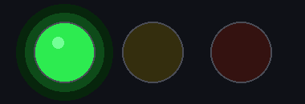

<h1> sd2snes+</h1>


Uma experiência mais amigável de firmware para sd2snes/FXPAK: idiomas, capas de jogos, música no menu, patches e reset para o menu mais prático.

**🌐 Idioma:** [English 🇺🇸](README.md) · Português · [Español 🇪🇸](README-ES.md) · [Deutsch 🇩🇪](README-DE.md) · [Français 🇫🇷](README-FR.md)

**Mais informações:** o hotsite [sd2snes.ludufre.com](https://sd2snes.ludufre.com) reúne mais detalhes, guias e exemplos visuais sobre este fork.

> **O que é isto?**
>
> Este é um fork do [firmware original do sd2snes](https://github.com/mrehkopf/sd2snes) de [@mrehkopf](https://github.com/mrehkopf). Ele mantém a base do firmware original e adiciona melhorias voltadas para quem usa o cartucho: menu em Português do Brasil, Inglês, Espanhol, Alemão e Francês, capas de jogos, música no menu, seleção de patches IPS/BPS e opções melhores de reset para o menu.
>
> Use este repositório para dúvidas ou bugs sobre a **tradução**, o **seletor de idioma**, as **capas**, a **música do menu**, o **seletor de patches** ou o **editor de temas deste fork**. Para problemas do firmware principal que não tenham relação com essas adições, use o projeto original.

## Comece aqui

Se você só quer usar este firmware, **não** precisa compilar nada nem baixar o código-fonte.

Você precisa de:

- Um cartucho sd2snes ou FXPAK.
- Um cartão SD já preparado para o seu cartucho.
- O `.zip` **full** da página [Releases](https://github.com/ludufre/sd2snes/releases) deste repositório.

> [!NOTE]
> Este projeto não inclui jogos/ROMs. Use seus próprios arquivos obtidos legalmente.

> [!IMPORTANT]
> **Hardware Mk.II:** o sd2snes original (Mk.II) tem pouca memória de programa no MCU. A partir da **v2.12**, o bootstrap do FPGA é carregado do cartão SD em vez da firmware, o que liberou cerca de **21 KB** e deu ao Mk.II bem mais folga. Ainda é a placa mais apertada das duas, então alguns recursos futuros podem ficar **só no Mk.III / FXPAK PRO** (ou desligados no Mk.II) por falta de espaço. O Mk.III / FXPAK PRO não é afetado, e tudo nesta versão funciona nos dois.

## O que este fork adiciona

- **Idiomas:** escolha Português do Brasil, Inglês, Espanhol, Alemão ou Francês diretamente no menu.
- **Descrições das opções:** uma linha de ajuda curta e traduzida para a opção de menu selecionada, numa caixa flutuante (posicionada acima ou abaixo do menu automaticamente).
- **Capas dos jogos:** veja a capa de cada jogo enquanto navega pela lista de ROMs.
- **Tela de info do jogo:** antes de uma ROM bootar, veja uma tela de detalhes com a capa, um screenshot e os metadados (desenvolvedora, ano, jogadores, gênero, chip especial) mais uma breve descrição, lidos de `/sd2snes/info/<rom>.yml`. Com a tela ligada ela aparece para toda ROM: uma sem entrada de info ainda ganha a tela com o nome do arquivo como título e — se existir uma capa `<rom>.cov` ao lado — essa box art no lugar onde ficaria a capa do `.gd`. Para um **screenshot animado**, coloque um `<rom>.fmv` (gerado de qualquer vídeo com `utils/gen_fmv.py`) ao lado da capa — a caixa do screenshot o reproduz em loop enquanto a capa `<rom>.cov` permanece ao lado. Liga/desliga em *Opções do Navegador* (ligado por padrão), onde duas sub-opções (em cinza quando desligado) escolhem se o clipe animado toca — senão aparece um snapshot estático — e se a trilha dele toca.
- **Música no menu:** toque uma faixa `.spc` de fundo enquanto navega.
- **Sons do menu:** efeitos sonoros de navegação opcionais (cursor, confirmar, voltar, erro) que tocam no DAC de áudio do cartucho, independentes da música.
- **Patches IPS/BPS:** escolha patches de tradução, hacks ou correções antes de iniciar um jogo, sem alterar a ROM no cartão SD.
- **Gerenciador de cheats:** o sd2snes original já aplica cheats — este fork adiciona um menu pra **ativar e desativar** os códigos de um jogo no console (a partir de `/sd2snes/cheats/<rom>.yml`), sem editar o YAML no PC. Dá para baixar cheats prontos no [gamehacking.org](https://gamehacking.org/system/snes) exportando como "FXPak Pro 1.7 (.yml)", ou baixá-los automaticamente pelo app **sd2snes Covers** (identificados por CRC32).
- **Deletar arquivo e save:** apague o arquivo selecionado ou só o save (`.srm`) direto pelo menu, sem tirar o cartão SD.
- **Melhorias no reset para o menu:** volte para a mesma pasta ou até para a mesma ROM depois de um reset curto.
- **Temas (firmware 2.9+):** escolha o tema do menu — logo, cores, fundo e barra de seleção — **direto no console**, a partir de qualquer pasta do cartão. Baixe temas prontos na [galeria](https://sd2snes.ludufre.com/gallery/) ou crie o seu no [editor web](https://sd2snes.ludufre.com/theme/).

## Instalação

Para a instalação mais simples, baixe a release marcada como **full**. Ela já inclui todos os arquivos de firmware necessários para este fork, então você **não** precisa baixar antes o firmware oficial equivalente.

O nome de cada release mostra a versão correspondente do firmware oficial. Por exemplo, **"v2.1 (sd2snes v1.11.2)"** foi feita para o firmware oficial `v1.11.2`.

1. Baixe o `.zip` **full** correspondente na página [Releases](https://github.com/ludufre/sd2snes/releases) deste repositório.
2. Abra o `.zip` e copie o conteúdo para a **raiz do cartão SD**.
3. Substitua os arquivos existentes quando o computador perguntar.
4. Coloque o cartão SD de volta no sd2snes/FXPAK e ligue o console.

Se você baixar um pacote que não seja full, ele contém apenas os arquivos alterados por este fork. Nesse caso, instale primeiro o firmware oficial correspondente em [sd2snes.de/blog/downloads](https://sd2snes.de/blog/downloads) e depois copie os arquivos deste fork para a pasta `/sd2snes`, substituindo os arquivos existentes.

O menu inicia em **Inglês por padrão**. Você pode trocar o idioma a qualquer momento pela opção **Idioma** no menu principal.

## Receber notificações de novas versões

Para receber uma notificação do GitHub sempre que uma nova versão do firmware for lançada:

1. Abra este repositório no GitHub.
2. Clique em **Watch**.
3. Escolha **Custom**.
4. Marque **Releases** e salve.

<p>


</p>

## Idiomas


O menu pode rodar em cinco idiomas:

- **Português:** tradução em Português do Brasil para menus, mensagens e telas.
- **English:** o idioma original e padrão do firmware.
- **Español:** tradução em Espanhol para menus, mensagens e telas.
- **Deutsch:** tradução em Alemão para menus, mensagens e telas.
- **Français:** tradução em Francês para menus, mensagens e telas.

Abra **Idioma** no menu principal, escolha o idioma desejado e o menu muda na hora. Sua escolha fica salva para a próxima vez que ligar o console.

## Capas dos jogos

As capas aparecem no menu enquanto você navega pelos jogos.

Para cada ROM, coloque um arquivo de capa na mesma pasta da ROM. O arquivo de capa precisa ter o mesmo nome da ROM, mas com a extensão `.cov`:

```text
/sd2snes/A/Aladdin (USA).sfc
/sd2snes/A/Aladdin (USA).cov
```

A forma mais fácil de criar arquivos `.cov` é usando o aplicativo gerador de capas:

### 👉 [github.com/ludufre/sd2snes-covers](https://github.com/ludufre/sd2snes-covers)

Use o **sd2snes-covers v1.1.0 ou mais novo**. Se você criou capas com uma versão mais antiga, gere as capas novamente com o app mais novo.

No menu, **Mostrar capas** tem três opções: **Grande** (capa inteira), **Pequeno** (metade do tamanho — útil quando a capa cobre a lista de arquivos) e **Desligado**. O padrão é **Grande**, então quem já usava as capas não precisa mudar nada.

## Patches IPS/BPS

Este fork pode aplicar patches **IPS** e **BPS** quando um jogo carrega. Isso é útil para traduções de fãs, hacks e correções.

A ROM no cartão SD não é alterada. O patch é aplicado apenas enquanto o jogo está sendo carregado.

Coloque o patch na mesma pasta da ROM. O nome do arquivo precisa começar com o nome da ROM, sem a extensão da ROM, e terminar em `.ips` ou `.bps`:

```text
/sd2snes/A/Aladdin (USA).sfc
/sd2snes/A/Aladdin (USA).ips
/sd2snes/A/Aladdin (USA) (Hack).bps
```

Ao abrir um jogo com patches correspondentes, o menu mostra um seletor de patch:

- **`[Sem patch]`** inicia o jogo normalmente.
- Escolha um patch para usá-lo neste boot.
- Até **8** patches são exibidos por jogo.

## Música e sons do menu

O menu pode tocar **música de fundo** enquanto você navega, além de quatro **efeitos sonoros de navegação** opcionais (cursor, confirmar, voltar, erro). Eles só tocam no menu e nunca afetam seus jogos.

O jeito mais fácil de configurar os dois é o **Criador de Sons** na web: escolha a música, crie os efeitos e baixe os arquivos prontos pra copiar pro cartão. Tudo roda no seu navegador — nada é enviado pra lugar nenhum.

### 👉 [sd2snes.ludufre.com/sounds](https://sd2snes.ludufre.com/sounds/)

### Música de fundo (`menu.spc`)

A música é um arquivo **`.spc`** chamado `menu.spc`, neste caminho:

```text
/sd2snes/menu.spc
```

Para adicionar música na mão:

1. Baixe um arquivo `.spc`.
2. Renomeie para `menu.spc`.
3. Copie para a pasta `/sd2snes/` do cartão SD.
4. Ligue o console.

Bons lugares para encontrar arquivos `.spc`:

- [snesmusic.org](https://snesmusic.org)
- [zophar.net/music](https://www.zophar.net/music/nintendo-snes-spc) — tem prévia em MP3 de cada faixa, então dá pra ouvir antes de baixar.

Você pode ligar ou desligar a música em **Configurações → Opções do Navegador → Música do menu**.

Você também pode escolher a música **sem renomear nada**: selecione qualquer **`.spc`** no navegador de arquivos, aperte **Y** para o menu de contexto e escolha **Definir como música do menu**. O menu recarrega com essa faixa como nova música de fundo e lembra dela entre reinícios; o `/sd2snes/menu.spc` continua como reserva. Para voltar a ele, use **Configurações → Opções do Navegador → Restaurar música**.

> [!TIP]
> Algumas trilhas vêm como arquivos `.rsn`. Um `.rsn` geralmente é um arquivo compactado com vários `.spc` dentro. Extraia o `.rsn` e escolha um dos arquivos `.spc`.

### Sons de navegação (efeitos)

Quatro efeitos curtos e opcionais tocam enquanto você anda pelo menu. Cada um é um arquivo separado em `/sd2snes/`:

| Arquivo | Toca quando |
| --- | --- |
| `sfx_cursor.pcm` | o cursor se move |
| `sfx_confirm.pcm` | você abre ou confirma (A) |
| `sfx_back.pcm` | você volta (B) |
| `sfx_error.pcm` | uma ação não é permitida |

São arquivos **MSU‑1 PCM** (16 bits stereo, 44,1 kHz). Tocam no DAC de áudio do cartucho, então nunca interrompem a música `.spc`. Um conjunto padrão já vem com o firmware, então o menu já tem sons de fábrica — use o Criador de Sons acima pra personalizar ou trocar. (Se um arquivo faltar, aquele efeito fica em silêncio.)

Você pode ligar ou desligar os efeitos em **Configurações → Opções do Navegador → Sons do menu**.

## Cheats

O firmware original do sd2snes já **aplica** cheats por jogo. O que este fork adiciona é um **gerenciador de cheats no menu**, pra você ativar e desativar cada código no próprio console — sem editar o YAML no PC.

Os cheats são lidos de um arquivo **YAML** (`.yml`) na pasta `/sd2snes/cheats/`, com o nome da ROM (a extensão dela trocada por `.yml`):

```text
/sd2snes/A/Aladdin (USA).sfc        ← a ROM (em qualquer pasta)
/sd2snes/cheats/Aladdin (USA).yml   ← os cheats dela
```

Para gerenciar, selecione uma ROM no navegador de arquivos, aperte **Y** para abrir o menu de contexto e escolha **Cheats**. A lista mostra cada código do arquivo:

- **A** ativa ou desativa o código destacado.
- **B** salva as alterações e sai.

Os códigos ativados são aplicados na próxima vez que você iniciar aquele jogo.

Para conseguir arquivos de cheats prontos:

1. Abra [gamehacking.org/system/snes](https://gamehacking.org/system/snes) e encontre o seu jogo.
2. Exporte os códigos usando o formato **FXPak Pro 1.7 (.yml)**.
3. Renomeie o arquivo para bater com a ROM e coloque-o em `/sd2snes/cheats/` no cartão SD.

> [!TIP]
> O app **[sd2snes Covers](https://github.com/ludufre/sd2snes-covers)** baixa cheats prontos automaticamente — identifica cada ROM pelo CRC32 e salva os arquivos `<rom>.yml` numa pasta `cheats/`, prontos para copiar em `/sd2snes/cheats/`.

> [!NOTE]
> Se a ROM não tiver um `.yml` em `/sd2snes/cheats/` (ou o arquivo não tiver códigos), o menu mostra a mensagem "Nenhum cheat definido para esta ROM".

## Menu de cheats no jogo

Além do gerenciador de cheats no menu, este fork pode abrir um **menu de cheats por cima do jogo em execução**, pra você ligar e desligar códigos sem resetar.

Durante o jogo, segure **L + R + Y + Esquerda** pra pausar e abrir a sobreposição:

- **Cima/Baixo** move o cursor.
- **A** liga ou desliga o código destacado.
- **B** fecha a sobreposição e aplica suas mudanças no jogo em execução.

Vem **habilitado por padrão**. Desligue em **Configuration → In-game Settings → In-game hook → Cheat menu**.

> [!TIP]
> O app **[sd2snes Covers](https://github.com/ludufre/sd2snes-covers)** também baixa os cheats dos jogos automaticamente.

> [!NOTE]
> Limitações atuais:
> - Só os primeiros **64** cheats são listados.
> - As alterações feitas na sobreposição **não são salvas** no arquivo `.yml` — valem só na sessão de jogo atual.
> - Igual aos savestates, **não funciona em jogos com Chips Especiais** (SA-1, SuperFX, etc.).
> - O layout ainda está feio (em progresso).

## Deletar arquivo e save

Você pode deletar arquivos e saves direto pelo menu, sem tirar o cartão SD nem usar o computador.

Selecione um arquivo no navegador e aperte **Y** para abrir o menu de contexto:

- **Deletar:** remove o arquivo selecionado.
- **Deletar save:** remove só o save `.srm` daquela ROM, mantendo a ROM.

> [!WARNING]
> A exclusão é permanente — não existe lixeira no cartão SD. Confira o arquivo selecionado antes de confirmar.

## Reset para o menu

O botão de reset pode levar você de volta ao menu do sd2snes em vez de apenas reiniciar o jogo. Este fork adiciona duas opções para facilitar o retorno à sua lista de jogos.

Configure em **Configurações → Opções no Jogo → Reset para o menu**:

- **Des:** o reset se comporta como um reset normal do SNES.
- **Lig:** um reset curto volta para o menu.
- **Pasta:** volta para o menu e abre a pasta do jogo que você estava jogando.
- **ROM:** volta para a pasta e destaca a ROM que você estava jogando.

As opções **Pasta** e **ROM** funcionam depois de um reset de volta para o menu. Ao ligar o console do zero, ele ainda começa no menu inicial normal.

## Temas

A partir do firmware **2.9**, você troca todo o visual do menu — **logo, cores, fundo e barra de seleção** — direto no console, sem PC.

1. Coloque arquivos de tema `.thm` em **qualquer pasta** do cartão — qualquer nome serve, só não pode ser a pasta oculta `/sd2snes`.
2. No menu, entre nessa pasta e aperte **A** num tema. O menu recarrega tematizado.
3. Para voltar ao padrão, use **Configurações → Opções do Navegador → Restaurar tema** no menu.

Você consegue temas de duas formas:

**Galeria — temas prontos, baixe num clique:**

### 👉 [sd2snes.ludufre.com/gallery](https://sd2snes.ludufre.com/gallery/)

**Editor de temas — crie o seu:** suba uma logo (com transparência), escolha as cores e baixe um `.thm`.

### 👉 [sd2snes.ludufre.com/theme](https://sd2snes.ludufre.com/theme/)

> [!NOTE]
> Avançado: também há um [editor de `m3nu.bin`](https://sd2snes.ludufre.com/theme/) que patcheia o menu inteiro (fluxo antigo). O editor de temas oficial do sd2snes não suporta o formato deste fork.

## Problemas comuns

**O menu não mudou depois da instalação.**

Confira se você usou a release **full** correspondente e copiou os arquivos para a raiz do cartão SD. Se usou um pacote que não seja full, confira se o firmware oficial correspondente foi instalado primeiro e se os arquivos deste fork foram copiados para `/sd2snes`.

**As capas não aparecem.**

Confira se as capas estão ativadas, se cada arquivo `.cov` tem o mesmo nome da ROM e se as capas foram geradas com o **sd2snes-covers v1.1.0 ou mais novo**.

**A música do menu não toca.**

Confira se o arquivo se chama exatamente `menu.spc`, se está em `/sd2snes/menu.spc` e se realmente é um arquivo `.spc`. MP3 e WAV não funcionam.

**Os sons de navegação não tocam.**

Confira se a opção **Sons do menu** está ligada, e se `sfx_cursor.pcm`, `sfx_confirm.pcm`, `sfx_back.pcm` e `sfx_error.pcm` estão em `/sd2snes/` e são arquivos **MSU‑1 PCM**. Eles vêm com o firmware; se você apagou, copie de volta do pacote do release ou recrie no [Criador de Sons](https://sd2snes.ludufre.com/sounds/).

**Um patch não aparece.**

Confira se o patch está na mesma pasta da ROM, começa com o nome da ROM e termina em `.ips` ou `.bps`.

**Mk.II (Spartan‑3): tela preta e um LED piscando feito sirene.**

A partir da **v2.12**, no **Mk.II** (FPGA Spartan‑3) o bootstrap do FPGA (`fpga_mini`) é carregado do cartão SD em vez de ficar embutido na firmware, o que libera espaço de flash para os recursos do fork. (O Mk.III / FXPAK PRO não é afetado — continua mostrando as mensagens na tela.) Por isso, quando o Mk.II não consegue subir a tela de boot, ele indica o motivo pelos **LEDs** em vez de texto. Isso **não** é defeito:

- **Sem cartão SD** → sirene verde ↔ vermelho. Coloque um cartão e desligue/ligue.

  

- **`/sd2snes/fpga_mini.bit` ausente ou ilegível** → sirene verde ↔ amarelo. Restaure‑o a partir do pacote de release e desligue/ligue.

  

O `fpga_mini.bit` vem no release v2.12+ — basta manter os arquivos do release em `/sd2snes/`.

## Notas avançadas

Esta seção é principalmente para desenvolvedores, mantenedores e usuários avançados. Você não precisa dela para a instalação normal.

### Formato das capas

Este firmware, a partir da versão **v1.11.2-br-2.1**, usa o formato `.cov` mais novo com sprites OBJ. Capas geradas por versões antigas do aplicativo de capas não aparecem corretamente. Gere as capas novamente com o **sd2snes-covers v1.1.0 ou mais novo**.

### Verificação de integridade de patches BPS

A verificação de integridade para BPS pode ser ativada em **Configurações → Opções de Patches → Verificar Integridade**.

Essa opção vem **Desativada por padrão**. Quando ligada, o firmware relê a ROM depois de aplicar um patch BPS para confirmar que ele foi aplicado corretamente. Isso deixa o carregamento de BPS mais lento; por exemplo, um patch BPS de 4 MB pode adicionar cerca de 15 segundos ao carregamento, em média. Patches IPS não são verificados por essa opção.

### Limitações da música e dos sons do menu

Para a música, apenas arquivos `.spc` são suportados. Um arquivo `.spc` não é uma gravação de áudio comum; ele é um snapshot do estado do chip de som do SNES e tem limite de 64 KB. Não existe conversão direta de MP3 para SPC — o Criador de Sons deixa você escolher e ouvir um `.spc`, mas não gera um a partir de outro áudio.

Quando a música carrega no boot, depois de um reset ou depois de ligar a opção, o menu pode pausar brevemente enquanto o arquivo é enviado para o chip de som do SNES. Abrir um `.spc` pelo navegador de arquivos pausa a música de fundo e retoma quando você volta com o botão B.

Os efeitos de navegação são separados: são clipes curtos em **MSU‑1 PCM** tocados no DAC de áudio do cartucho (16 bits stereo, 44,1 kHz), então a música continua tocando no chip de som do SNES enquanto um efeito dispara. Mantenha-os curtos (bem menos de um segundo) pra ficarem responsivos.

### Formato do tema

O editor de temas oficial espera o layout original do sd2snes, com logo ocupando toda a largura do cabeçalho. Este fork mudou o cabeçalho do menu para abrir espaço para as capas dos jogos:

- Área do logo original: **256×56**
- Área do logo neste fork: **128×56**
- O lado direito do cabeçalho fica reservado para a capa do jogo
- O logo usa uma paleta de cores própria

Por isso, o editor oficial não consegue ler nem gravar corretamente o `m3nu.bin` deste fork.

### Compilar a partir do código-fonte

Todos os binários de release são compilados localmente com Docker. O único requisito na sua máquina é o próprio Docker:

```
./build-docker.sh
```

Isso compila tudo de uma vez: o firmware da MCU (`firmware.img` para Mk.II, `firmware.im3` para Mk.III, `firmware.stm` para FXPAK PRO STM32), o menu do SNES (`menu.bin` / `m3nu.bin`) e o companion ESP (`esp32.bin` / `esp8266.bin`). Em seguida monta dois zips em `release/`:

- `sd2snes_firmware_v<VER>.zip`: apenas os binários modificados do fork
- `sd2snes_firmware_v<VER>-full.zip`: a base oficial do sd2snes mais os binários do fork

`<VER>` vem de `RELEASE_VERSION` em `src/VERSION`.

No dia a dia, `./build-docker.sh` basta. A imagem de build e os cores da FPGA ficam em cache, então cada execução só recompila a MCU, o menu e o companion. Outras flags:

- `--reuse`: pula a compilação e só reempacota o que já está em `bin/`
- `--rebuild-image`: força a reconstrução da imagem de build do Docker

O firmware embute o core de bootstrap da FPGA (cfgware). O core do Mk.III/STM32 (`fpga_mini.bi3`, Cyclone IV) é sintetizado com o Intel Quartus e embutido na imagem de build automaticamente. O core do Mk.II (`fpga_mini.bit`, Spartan-3) é reaproveitado da árvore por padrão. Para re-sintetizá-lo com o Xilinx ISE dentro do Docker:

```
./build-docker.sh --with-ise
```

Esse passo é pesado e precisa do instalador do Xilinx ISE 14.7 e de uma licença WebPACK em `XILINX_SRC` (padrão `~/Downloads`). Como o fork não altera a FPGA, você raramente precisa dele.

### Créditos

O suporte a patches IPS/BPS e o trabalho original de reset para o menu vêm de [@Xeroxxx](https://github.com/mrehkopf/sd2snes/pull/293), com alterações feitas neste fork.

O suporte ao menu de cheats vem de [@Relikk](https://github.com/Relikk).

Contribuidores do repositório original do sd2snes listados pelo GitHub:

- [@mrehkopf](https://github.com/mrehkopf)
- [@RedGuyyyy](https://github.com/RedGuyyyy)
- [@Relikk](https://github.com/Relikk)
- [@github-user-name](https://github.com/github-user-name)
- [@furious](https://github.com/furious)
- [@redacted173](https://github.com/redacted173)
- [@francois-berder](https://github.com/francois-berder)
- [@Godzil](https://github.com/Godzil)
- [@mlarouche](https://github.com/mlarouche)
- [@devinacker](https://github.com/devinacker)
- [@Xeroxxx](https://github.com/Xeroxxx)
- [@tcprescott](https://github.com/tcprescott)
- [@freelancer42](https://github.com/freelancer42)
- [@LuigiBlood](https://github.com/LuigiBlood)
- [@DevLaTron](https://github.com/DevLaTron)
- [@gasparitiago](https://github.com/gasparitiago)

### Código-fonte e licença

Este projeto continua licenciado sob a GNU General Public License v2.0 (GPL-2.0), seguindo a licença do projeto original sd2snes.

Todos os direitos autorais originais pertencem aos seus respectivos autores e contribuidores.

Alterações específicas deste fork:
Copyright (C) 2026 Luan Freitas e contribuidores

O código-fonte de todos os binários/releases distribuídos está disponível neste repositório e nas tags/releases correspondentes do Git, em conformidade com os requisitos da GPL.

Veja o [README original](https://github.com/mrehkopf/sd2snes/blob/master/README.md).

Veja o [README do FURiOUS](README.Savestates.FURiOUS.md) para informações sobre Save States.
