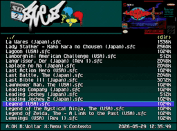
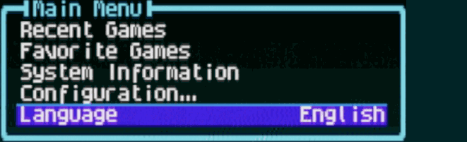
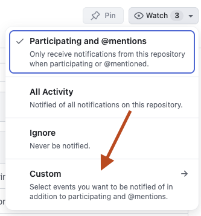
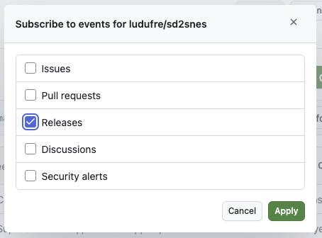

<h1> sd2snes+</h1>




A friendlier sd2snes/FXPAK firmware experience: languages, game covers, menu music, patches and smarter reset-to-menu behavior.

**🌐 Language:** English · [Português 🇧🇷](README-BR.md) · [Español 🇪🇸](README-ES.md) · [Deutsch 🇩🇪](README-DE.md)

**More information:** [sd2snes.ludufre.com](https://sd2snes.ludufre.com) has more details, guides and visual examples for this fork.

> **What is this?**
>
> This is a fork of the [original sd2snes firmware](https://github.com/mrehkopf/sd2snes) by [@mrehkopf](https://github.com/mrehkopf). It keeps the original firmware base and adds user-facing improvements: a menu in Brazilian Portuguese, English, Spanish and German, game covers, menu music, IPS/BPS patch selection and better reset-to-menu options.
>
> Use this repository for questions or bugs about the **translation**, **language selector**, **covers**, **menu music**, **patch selector** or **theme editor for this fork**. For core firmware issues unrelated to these additions, please use the original project.

## Start Here

If you just want to use this firmware, you do **not** need to compile anything or download the source code.

You need:

- An sd2snes or FXPAK cartridge.
- An SD card already prepared for your cartridge.
- The **full** `.zip` from this repository's [Releases](https://github.com/ludufre/sd2snes/releases) page.

> [!NOTE]
> This project does not include games/ROMs. Use your own legally obtained files.

> [!IMPORTANT]
> **Mk.II hardware:** the original sd2snes (Mk.II) has limited MCU program flash, and this firmware is already close to that limit. Some future features may end up **Mk.III / FXPAK PRO only** (or disabled on Mk.II) simply for lack of space. Mk.III / FXPAK PRO is unaffected, and everything in the current release works on both.

## What This Fork Adds

- **Languages:** choose Brazilian Portuguese, English, Spanish or German directly in the menu.
- **Option descriptions:** a short, translated help line for the selected menu option, shown in a floating box (auto-placed above or below the menu).
- **Game covers:** show each game's box art while browsing your ROM list.
- **Menu music:** play an `.spc` track in the background while browsing.
- **Menu sounds:** optional navigation sound effects (cursor, confirm, back, error) that play on the cartridge's audio DAC, independent of the music.
- **IPS/BPS patches:** choose translation, hack or fix patches before a game starts, without changing the ROM file on the SD card.
- **Cheat manager:** the original sd2snes already applies cheats — this fork adds a menu to **enable and disable** a game's codes on the console (from `/sd2snes/cheats/<rom>.yml`), without editing the YAML on a PC. Ready-made cheats can be exported from [gamehacking.org](https://gamehacking.org/system/snes) as "FXPak Pro 1.7 (.yml)", or downloaded automatically by the **sd2snes Covers** app (matched by CRC32).
- **Delete file and savegame:** delete the selected file or just its save (`.srm`) straight from the menu, without removing the SD card.
- **Reset to menu improvements:** return to the same folder or even the same ROM after a short reset.
- **Themes (firmware 2.9+):** pick a menu theme — logo, colors, background and selection bar — **right on the console**, from any folder on the card. Download ready-made themes from the [gallery](https://sd2snes.ludufre.com/gallery/) or build your own in the [web editor](https://sd2snes.ludufre.com/theme/).

## Installation

For the easiest installation, download the release marked **full**. It already includes the complete firmware files needed by this fork, so you do **not** need to download the equivalent official firmware first.

Each release name shows the matching official firmware version. For example, **"v2.1 (sd2snes v1.11.2)"** is meant for official firmware `v1.11.2`.

1. Download the matching **full** `.zip` from this repository's [Releases](https://github.com/ludufre/sd2snes/releases).
2. Open the `.zip` and copy its contents to the **root of your SD card**.
3. Replace existing files when your computer asks.
4. Put the SD card back into the sd2snes/FXPAK and turn on the console.

If you download a non-full package instead, it contains only the files changed by this fork. In that case, install the matching official firmware from [sd2snes.de/blog/downloads](https://sd2snes.de/blog/downloads) first, then copy this fork's files into the `/sd2snes` folder over the existing files.

The menu starts in **English by default**. You can change it anytime from the **Language** option in the main menu.

## Get Notified About New Versions

To receive a GitHub notification whenever a new firmware version is released:

1. Open this repository on GitHub.
2. Click **Watch**.
3. Choose **Custom**.
4. Select **Releases** and save.

<p>


</p>

## Languages


The menu can run in four languages:

- **Português:** Brazilian Portuguese translation for menus, messages and screens.
- **English:** the original and default firmware language.
- **Español:** Spanish translation for menus, messages and screens.
- **Deutsch:** German translation for menus, messages and screens.

Open **Language** in the main menu, choose the language you want, and the menu changes immediately. Your choice is saved for the next time you turn on the console.

## Game Covers

Game covers appear in the menu while you browse your games.

For each ROM, place a cover file in the same folder as the ROM. The cover file must have the same name as the ROM, but with the `.cov` extension:

```text
/sd2snes/A/Aladdin (USA).sfc
/sd2snes/A/Aladdin (USA).cov
```

The easiest way to create `.cov` files is with the cover generator app:

### 👉 [github.com/ludufre/sd2snes-covers](https://github.com/ludufre/sd2snes-covers)

Use **sd2snes-covers v1.1.0 or newer**. If you made covers with an older version, regenerate them with the newer app.

In the menu, **Mostrar capas** / **Show covers** has three settings: **Large** (the full box art), **Small** (half size — handy when a cover overlaps the file list) and **Off**. *Large* is the default, so existing setups are unaffected.

## IPS/BPS Patches

This fork can apply **IPS** and **BPS** patches when a game loads. This is useful for fan translations, hacks and fixes.

Your ROM file on the SD card is not changed. The patch is applied only while the game is being loaded.

Put the patch in the same folder as the ROM. Its filename must start with the ROM filename, without the ROM extension, and end in `.ips` or `.bps`:

```text
/sd2snes/A/Aladdin (USA).sfc
/sd2snes/A/Aladdin (USA).ips
/sd2snes/A/Aladdin (USA) (Hack).bps
```

When you open a game with matching patches, the menu shows a patch selector:

- **`[No patch]`** starts the game normally.
- Choose a patch to use it for this boot.
- Up to **8** patches are shown for each game.

## Menu Music and Sounds

The menu can play **background music** while you browse, plus four optional **navigation sound effects** (cursor, confirm, back, error). They only play in the menu and never affect your games.

The easiest way to set both up is the web **Sound Creator**: pick the music, make the effects, and download the files ready to copy to the card. Everything runs in your browser — nothing is uploaded.

### 👉 [sd2snes.ludufre.com/sounds](https://sd2snes.ludufre.com/sounds/)

### Background music (`menu.spc`)

The music is an **`.spc`** file named `menu.spc`, placed here:

```text
/sd2snes/menu.spc
```

To add music by hand:

1. Download an `.spc` file.
2. Rename it to `menu.spc`.
3. Copy it into the `/sd2snes/` folder on your SD card.
4. Turn on the console.

Good places to find `.spc` files:

- [snesmusic.org](https://snesmusic.org)
- [zophar.net/music](https://www.zophar.net/music/nintendo-snes-spc) — has an MP3 preview for each track, so you can listen before downloading.

Turn the music on or off in **Configuration → Browser Settings → Menu music**.

You can also choose the music **without renaming anything**: highlight any **`.spc`** in the file browser, press **Y** for the context menu and choose **Set as menu music**. The menu reloads with that track as the new background music and remembers it across reboots; `/sd2snes/menu.spc` stays as the fallback. To go back to it, use **Configuration → Browser Settings → Restore music**.

> [!TIP]
> Some soundtracks are downloaded as `.rsn` files. An `.rsn` is usually an archive that contains several `.spc` files. Extract it and choose one `.spc` from inside.

### Navigation sounds (effects)

Four short, optional effects play as you move through the menu. Each is a separate file in `/sd2snes/`:

| File | Plays when |
| --- | --- |
| `sfx_cursor.pcm` | the cursor moves |
| `sfx_confirm.pcm` | you open or confirm (A) |
| `sfx_back.pcm` | you go back (B) |
| `sfx_error.pcm` | an action is not allowed |

These are **MSU‑1 PCM** files (16‑bit stereo, 44.1 kHz). They play on the cartridge's audio DAC, so they never interrupt the `.spc` music. A default set ships with the firmware, so the menu has sounds out of the box — use the Sound Creator above to customize or replace them. (A missing file just means that effect stays silent.)

Turn the effects on or off in **Configuration → Browser Settings → Menu sounds**.

## Cheats

The original sd2snes firmware already **applies** cheats per game. What this fork adds is a **cheat manager in the menu**, so you can enable and disable individual codes on the console — without editing the YAML on a PC.

Cheats are read from a **YAML** file (`.yml`) in the `/sd2snes/cheats/` folder, named after the ROM (its extension replaced by `.yml`):

```text
/sd2snes/A/Aladdin (USA).sfc        ← the ROM (in any folder)
/sd2snes/cheats/Aladdin (USA).yml   ← its cheats
```

To manage them, highlight a ROM in the file browser, press **Y** for the context menu and choose **Cheats**. The list shows every code in the file:

- **A** enables or disables the highlighted code.
- **B** saves your changes and exits.

Enabled codes are applied the next time you start that game.

To get ready-made cheat files:

1. Open [gamehacking.org/system/snes](https://gamehacking.org/system/snes) and find your game.
2. Export its codes using the **FXPak Pro 1.7 (.yml)** format.
3. Rename the file to match the ROM and drop it in `/sd2snes/cheats/` on the SD card.

> [!TIP]
> The **[sd2snes Covers](https://github.com/ludufre/sd2snes-covers)** app can fetch ready-made cheats automatically — it matches each ROM by CRC32 and saves `<rom>.yml` files into a `cheats/` folder, ready to copy into `/sd2snes/cheats/`.

> [!NOTE]
> If a ROM has no `.yml` in `/sd2snes/cheats/` (or the file has no codes), the menu shows a "no cheats for this ROM" message.

## Delete File and Savegame

You can delete files and saves straight from the menu, without removing the SD card or using a computer.

Highlight a file in the browser and press **Y** for the context menu:

- **Delete:** removes the selected file.
- **Delete save:** removes only the `.srm` savegame for that ROM, keeping the ROM itself.

> [!WARNING]
> Deletion is permanent — there is no recycle bin on the SD card. Double-check the selected file before confirming.

## Reset to Menu

The reset button can bring you back to the sd2snes menu instead of simply restarting the game. This fork adds two options that make returning to your game list easier.

Set it in **Configuration → In-game Settings → Reset to menu**:

- **Off:** reset behaves like a normal SNES reset.
- **On:** a short reset returns to the menu.
- **Folder:** returns to the menu and opens the folder of the game you were playing.
- **ROM:** returns to the folder and highlights the ROM you were playing.

The **Folder** and **ROM** options work after a reset back to the menu. A full power-on still starts from the normal top-level menu.

## Themes

From firmware **2.9** on, you can change the whole menu look — **logo, colors, background and selection bar** — right on the console, no PC needed.

1. Put `.thm` theme files in **any folder** on your SD card — any name works, it just can't be the hidden `/sd2snes` folder.
2. In the menu, open that folder and press **A** on a theme. The menu reloads themed.
3. To go back to the default look, go to **Configuration → Browser Settings → Restore theme** in the menu.

You can get themes in two ways:

**Gallery — ready-made themes, one click to download:**

### 👉 [sd2snes.ludufre.com/gallery](https://sd2snes.ludufre.com/gallery/)

**Theme Creator — make your own:** upload a logo (with transparency), pick the colors and download a `.thm`.

### 👉 [sd2snes.ludufre.com/theme](https://sd2snes.ludufre.com/theme/)

> [!NOTE]
> Advanced: there's also a [`m3nu.bin` editor](https://sd2snes.ludufre.com/theme/) that patches a full menu binary (the older workflow). The official sd2snes theme editor does not support this fork's format.

## Common Problems

**The menu did not change after installing.**

Check that you used the matching **full** release and copied its files to the root of the SD card. If you used a non-full package, check that the matching official firmware was installed first and that this fork's files were copied into `/sd2snes`.

**Covers do not appear.**

Check that covers are enabled, that each `.cov` file has the same name as its ROM, and that the covers were generated with **sd2snes-covers v1.1.0 or newer**.

**Menu music is silent.**

Check that the file is named exactly `menu.spc`, is placed at `/sd2snes/menu.spc`, and is really an `.spc` file. MP3 and WAV files do not work.

**Navigation sounds are silent.**

Check that **Menu sounds** is turned on, and that `sfx_cursor.pcm`, `sfx_confirm.pcm`, `sfx_back.pcm` and `sfx_error.pcm` are in `/sd2snes/` and are **MSU‑1 PCM** files. They ship with the firmware; if you removed them, copy them back from the release package or recreate them with the [Sound Creator](https://sd2snes.ludufre.com/sounds/).

**A patch does not appear.**

Check that the patch is in the same folder as the ROM, starts with the ROM filename, and ends in `.ips` or `.bps`.

## Advanced Notes

This section is mainly for developers, maintainers and advanced users. You do not need it for normal installation.

### Cover Format

This firmware, starting with **v1.11.2-br-2.1**, uses the newer OBJ-sprite `.cov` cover format. Covers generated by older versions of the cover app will not display correctly. Regenerate them with **sd2snes-covers v1.1.0 or newer**.

### BPS Patch Integrity Check

The BPS integrity check can be enabled from **Configuration → Patch Options → Verify Integrity**.

This option is **Off by default**. When enabled, the firmware re-reads the ROM after applying a BPS patch to confirm it was applied correctly. This makes BPS loading slower; for example, a 4 MB BPS patch can add around 15 seconds of loading time on average. IPS patches are not verified by this option.

### Menu Music and Sound Limitations

For the music, only `.spc` files are supported. An `.spc` file is not a normal audio recording; it is a snapshot of the SNES sound chip state and is capped at 64 KB. There is no direct MP3-to-SPC conversion — the Sound Creator lets you pick and preview an `.spc`, it does not generate one from other audio.

When music loads at boot, after a reset or after turning the option on, the menu may pause briefly while the file is uploaded to the SNES sound chip. Opening an `.spc` from the file browser pauses the background music and resumes it when you return with the B button.

The navigation effects are separate: they are short **MSU‑1 PCM** clips played on the cartridge's audio DAC (16‑bit stereo, 44.1 kHz), so the music keeps playing on the SNES sound chip while an effect fires. Keep them short (well under a second) so they feel snappy.

### Theme Format

The official theme editor expects the original full-width sd2snes logo layout. This fork changed the menu header to make room for game covers:

- Original logo area: **256×56**
- This fork's logo area: **128×56**
- The right side of the header is reserved for the game cover
- The logo uses its own color palette

Because of this, the official editor cannot read or write this fork's `m3nu.bin` correctly.

### Building from Source

All release binaries are built locally with Docker. The only requirement on your machine is Docker itself:

```
./build-docker.sh
```

This compiles everything in one run: the MCU firmware (`firmware.img` for Mk.II, `firmware.im3` for Mk.III, `firmware.stm` for FXPAK PRO STM32), the SNES menu (`menu.bin` / `m3nu.bin`) and the ESP companion (`esp32.bin` / `esp8266.bin`). It then packages two zips in `release/`:

- `sd2snes_firmware_v<VER>.zip`: only the fork's modified binaries
- `sd2snes_firmware_v<VER>-full.zip`: the official sd2snes base plus the fork binaries

`<VER>` comes from `RELEASE_VERSION` in `src/VERSION`.

For day to day work, `./build-docker.sh` is all you need. The build image and the FPGA cores are cached, so each run just recompiles the MCU, the menu and the companion. Other flags:

- `--reuse`: skip compilation and only repackage what is already in `bin/`
- `--rebuild-image`: force the Docker build image to be rebuilt

The firmware embeds the FPGA bootstrap core (cfgware). The Mk.III/STM32 core (`fpga_mini.bi3`, Cyclone IV) is synthesized with Intel Quartus and baked into the build image automatically. The Mk.II core (`fpga_mini.bit`, Spartan-3) is reused from the tree by default. To re-synthesize it with Xilinx ISE inside Docker:

```
./build-docker.sh --with-ise
```

This step is heavy and needs the Xilinx ISE 14.7 installer and a WebPACK license in `XILINX_SRC` (default `~/Downloads`). Since the fork does not change the FPGA, you rarely need it.

### Credits

The IPS/BPS patch support and the original reset-to-menu work come from [@Xeroxxx](https://github.com/mrehkopf/sd2snes/pull/293), with changes made in this fork.

The in-game cheat menu work come from [@Relikk](https://github.com/Relikk).

Original sd2snes repository contributors listed by GitHub:

- [@mrehkopf](https://github.com/mrehkopf)
- [@RedGuyyyy](https://github.com/RedGuyyyy)
- [@Relikk](https://github.com/Relikk)
- [@github-user-name](https://github.com/github-user-name)
- [@furious](https://github.com/furious)
- [@redacted173](https://github.com/redacted173)
- [@francois-berder](https://github.com/francois-berder)
- [@Godzil](https://github.com/Godzil)
- [@mlarouche](https://github.com/mlarouche)
- [@devinacker](https://github.com/devinacker)
- [@Xeroxxx](https://github.com/Xeroxxx)
- [@tcprescott](https://github.com/tcprescott)
- [@freelancer42](https://github.com/freelancer42)
- [@LuigiBlood](https://github.com/LuigiBlood)
- [@DevLaTron](https://github.com/DevLaTron)
- [@gasparitiago](https://github.com/gasparitiago)

### Source Code and License

This project remains licensed under the GNU General Public License v2.0 (GPL-2.0), following the original sd2snes project license.

All original copyrights belong to their respective authors and contributors.

Fork-specific changes:
Copyright (C) 2026 Luan Freitas and contributors

Source code for all distributed binaries/releases is available in this repository and corresponding Git tags/releases, in accordance with GPL requirements.

See the [Original README](https://github.com/mrehkopf/sd2snes/blob/master/README.md).

See [FURiOUS's README](README.Savestates.FURiOUS.md) for information on Save States.
