

**🌐 Language:** English · [Português 🇧🇷](https://sd2snes.ludufre.com/?lang=pt) · [Español 🇪🇸](https://sd2snes.ludufre.com/?lang=es) · [Deutsch 🇩🇪](https://sd2snes.ludufre.com/?lang=de) · [Français 🇫🇷](https://sd2snes.ludufre.com/?lang=fr) · [Italiano 🇮🇹](https://sd2snes.ludufre.com/?lang=it)

> **What is this?** A version of the [original sd2snes firmware](https://github.com/mrehkopf/sd2snes) by [@mrehkopf](https://github.com/mrehkopf) that keeps the firmware base and adds user-facing extras. Use this repo only for issues about **those additions** — for core firmware issues, use the original project.

## 👉 Full guides, downloads, tools and FAQ: **[sd2snes.ludufre.com](https://sd2snes.ludufre.com)**

Everything below is a quick overview. **The site has the step-by-step guides, screenshots and the web tools** — head there for anything beyond the basics.

## Get it running

1. Download the **full** `.zip` from [**Releases**](https://github.com/ludufre/sd2snes/releases).
2. Copy its contents to the **root of your SD card** (replace when asked).
3. **Fill your library:** with the SD card still in your computer, open the **[Web Manager](https://sd2snes.ludufre.com/manager/)** in your browser and connect the card — it scans your ROMs and downloads **box art, game-info cards (with animated video clips) and cheats** straight onto the card. Runs in the browser, nothing to install.
4. Put the card back and power on. Change the language anytime in the **Language** menu.

> [!NOTE]
> No games/ROMs are included — use your own legally obtained files.

> [!IMPORTANT]
> **Updating from 2.14 or older?** 2.15 keeps saves, cheats, savestates, covers and game info in **two-letter folders** (`/sd2snes/saves/SU/Super Mario World.srm`), which is what makes a game open instantly on a card holding thousands of files. Nothing is deleted, but until the card is reorganised those files look like they are gone. The **[Web Manager](https://sd2snes.ludufre.com/manager/)** detects firmware 2.15+ and organises the card for you — you can also run it whenever you want from the **Organize** button at the top. Also copy the *whole* package: 2.15 ships new files in `/sd2snes` (`igmenu.bin`, `classic.thm` and the NES/Master System cores) that several features depend on.

Downloads, the step-by-step install and troubleshooting live on the site:
[Downloads](https://sd2snes.ludufre.com/#downloads) · [Install guide](https://sd2snes.ludufre.com/#instalar) · [FAQ](https://sd2snes.ludufre.com/#faq) — e.g. [Which firmware version do I have?](https://sd2snes.ludufre.com/#faq-versao) · [Black screen / blinking LED on Mk.II?](https://sd2snes.ludufre.com/#faq-tela-preta)

## What sd2snes+ Adds

| Preview | Feature |
| :-----: | :------ |
| 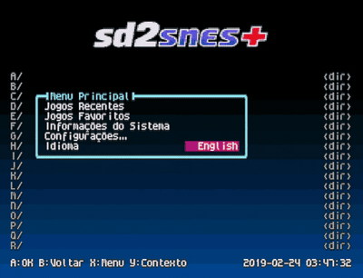 | **Menu in Portuguese, English, Spanish, German, French & Italian** The whole firmware menu, messages and screens translated to Brazilian Portuguese, Spanish, German, French and Italian. The original English stays available — just pick one. |
| 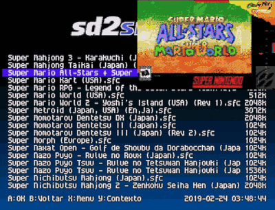 | **Box-art in the game list** As you browse, the game's official cover shows up on screen. Just drop a .cov file with the same name as the ROM in the same folder. To build the whole collection at once, the Web Manager downloads box art in bulk (and the cheats too). |
| 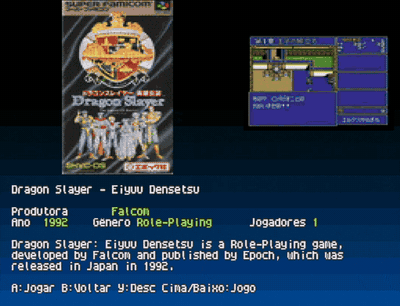 | **See the game's info card before playing** Before a ROM boots, a full-screen card shows the cover, a screenshot (or an animated clip with sound) and the game's metadata — developer, year, players, genre and special chip — plus a short description. In the menu you can choose whether the clip plays (with its soundtrack) or just a static snapshot shows. The Web Manager downloads each game's info card automatically. |
| 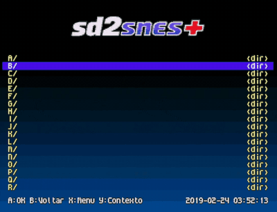 | **Menu music and sounds** Plays an .spc track in the background while you browse — plus 4 navigation sound effects (cursor, confirm, back, error). Build it all in the Sound Creator: pick the .spc, preview it in the browser, swap the effects and download them ready for the card. |
| 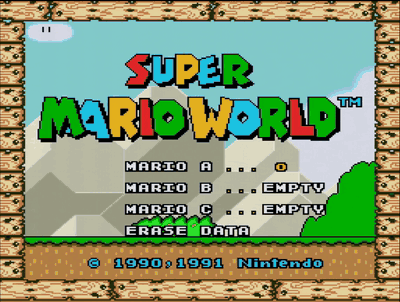 | **In-game menu with tabs** Pause the running game with L + R + Y + ← and get a full menu drawn in your theme, with four tabs: **CHEATS** (toggle codes live — all of them, not just the first 64), **SAVESTATES** (pick the slot, occupied ones are marked), **SAVES** (battery save status and the SRAM slot selector) and **GUIDES** (the game's manuals on screen). B steps back, START closes, and the game resumes exactly where it left off — it even remembers the tab, the cursor and the page you were reading. On by default; turn it off in Configuration › In-game Settings › In-game menu. Needs `/sd2snes/igmenu.bin` on the card, otherwise it falls back to the old single-tab cheat overlay. Available on most special-chip games too (not on SPC7110 or Super Game Boy). |
| 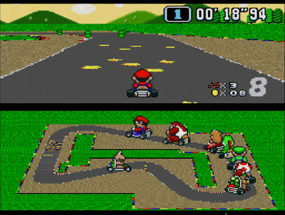 | **Savestates on special-chip games** Savestates never worked on games with a special chip — now they do: **DSP1/1b/2/3/4** (Super Mario Kart, Pilotwings), **Super FX** (Star Fox, Yoshi's Island), **OBC1** (Metal Combat), **S-DD1** (Star Ocean) and **CX4** (Mega Man X2/X3) on both Mk.II and Mk.III, plus **SA-1** (Super Mario RPG) on the FXPak Pro (Mk.III) only. Save with Start + R, load with Start + L, pick the slot with Select + D-pad or in the SAVESTATES tab. A handful of games need a different combo because Start pauses them — those are listed in `/sd2snes/savestate_inputs.yml` on the card (Donkey Kong Country 1/2/3, Yoshi's Island, Mega Man X/X2/X3 and Star Fox use X + R / X + L; Super Valis IV uses A + R / A + L). It is a plain checksum-to-combo list, so you can add your own games to it. Built on top of the [save states by FURiOUS](https://github.com/mrehkopf/sd2snes/blob/master/README.Savestates.FURiOUS.md). |
| 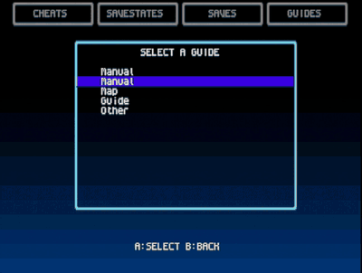 | **Read the game manual on your TV** Convert a PDF manual, walkthrough, map or insert to `.man` (see `utils/gen_man.py`), drop it in `/sd2snes/info/<BB>/` next to the game's other info files, and read it on the TV with the game frozen — from the GUIDES tab, or straight from the game info card by pressing X before you start. L/R turns the page, A zooms 2x and the D-pad pans across the enlarged page; it remembers where you stopped. Up to 8 documents per game, each with its own title and type. The Web Manager downloads them for you. |
| 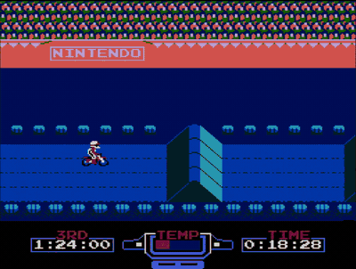 | **Master System, NES and Atari 2600 (experimental, Mk.III only)** The FPGA learned to become three more consoles: drop a `.sms`, `.nes` or `.a26` on the card and it shows up in the list like any other game. **This is a preview, not a finished feature:** NES games with a battery run but **do not save**, and the Master System does not write to cartridge RAM; compatibility is low and many games freeze or glitch. NES mappers 0, 1, 2, 3, 4 (MMC3), 7 and 28 are supported. In-game reset works from the pad: **L + R + Select + X** returns to the menu and **L + R + Start + Select** restarts the game.  The **Atari 2600** is the newest and the roughest of the three. It plays NTSC cartridges of 2K and 4K plus the F8, F6 and F4 bankswitching schemes, including their Superchip variants (F8SC/F6SC/F4SC, with the extra 128 bytes of RAM); E0, 3F, FE, FA, DPC and Supercharger carts, PAL games and the paddle/keypad/driving controllers are **not** supported yet. Both joysticks are mapped to the SNES pads — D-pad to move, B/A/Y to fire — and the console switches to the rest: hold **Start** for the console's RESET switch, hold **Select** for SELECT, **X** flips Color/B&W and **L**/**R** flip the left/right difficulty switches. Holding L + R together leaves the switches inert, so the in-game reset combos keep working. Sound is the TIA's two channels with all 16 waveform modes. The picture is drawn in two bits per pixel with the colours changed line by line, and a menu option picks its width: **160 (1:1)**, the console's own resolution with black bars at the sides, or **256**, filling the screen (`A26VideoWidth` in `config.yml`). Its two files on the card are `/sd2snes/fpga_a26.bi3` and `/sd2snes/a26_snes.bin`.  All three need their extra core files on the card and do not fit in the smaller FPGA of the SD2SNES (Mk.II) — on a Mk.II the files still show up in the list, but trying to load one just shows a "Requires Mk.III hardware" message. See the [compatibility list](https://sd2snes.ludufre.com/gamesdb/compatibility). |
| 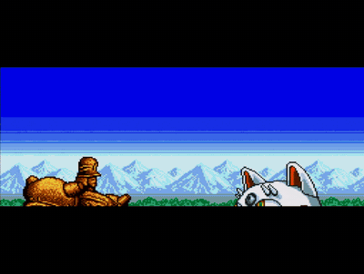 | **Far East of Eden Zero and the other SPC7110 games** The SPC7110 is the Hudson coprocessor found in a handful of Japanese carts — *Far East of Eden Zero* (Tengai Makyou Zero), *Momotarou Dentetsu Happy* and *Super Power League 4*. It decompresses graphics in hardware, multiplies and divides for the game, walks a second data ROM through a pointer engine and, on *Far East of Eden Zero*, carries a battery-backed real-time clock. The official firmware only reports the chip as unsupported; sd2snes+ turns the FPGA into one — on **both** the FXPak Pro (Mk.III) and the SD2SNES (Mk.II). Battery saves behave like any other game, and the in-game calendar keeps real time: on Mk.III a `.rtc` file next to the save keeps what the cartridge battery used to keep — including a clock the game itself stopped — so it survives a power cycle, while on Mk.II the clock starts from the console's own time at every load. No BIOS file is involved, only `/sd2snes/fpga_spc7110.bi3` (Mk.III) or `.bit` (Mk.II) from the release package. The in-game menu, the cheat overlay and savestates are not available on this chip yet — the same gap the Super Game Boy has. Note that the English fan translation of *Far East of Eden Zero* does not run on real hardware: it was built against emulators and leans on behaviour the actual cartridge never had (the original Japanese ROM runs fine). The core is written for this fork, with the chip's behaviour taken from the [ares](https://github.com/ares-emulator/ares) C++ implementation. |
| 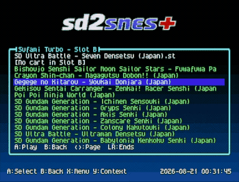 | **Sufami Turbo minicarts (Mk.III only)** The Sufami Turbo is the Bandai passthrough cartridge with **two** minicart slots. Drop the `.st` dumps on the card, add the base cartridge BIOS as `/sd2snes/stbios.bin`, and sd2snes+ boots them — picking the **Slot B** companion cart in a dialog right before the game starts, and remembering the pair for next time. Both minicarts keep their own battery save, because that is what the hardware does: each cart carries its own SRAM chip, and the linkable titles (the *SD Gundam Generation* series and friends) exist precisely to write into the cart in the **other** slot. Each save is named after its own cart, so a companion cart carries its data into whatever pair you use it in next. The FPGA gets a second set of ROM and SaveRAM masks so the two slots can never alias onto each other, whatever sizes they declare. Savestates are not available on these games (the in-game menu and cheats are). |
| 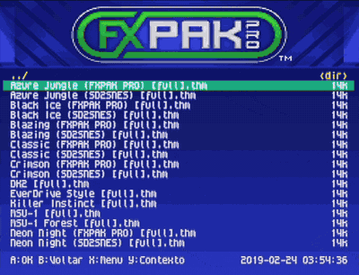 | **Switch the menu theme on the console** From firmware 2.9 on, pick the menu theme right on the SNES — logo, colours, background and selection bar. Drop .thm files in any folder on the card and choose one in the browser. Grab ready-made themes in the gallery or build your own in the web editor. Since 2.15 the **sd2snes+** theme is the factory default, with *Restore classic theme* in Browser Options to bring the old look back (needs `/sd2snes/classic.thm` on the card); themes can also switch off the text outline and the anti-aliasing, and toggle the selection-bar shadow. |
| 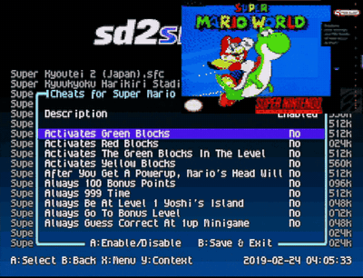 | **Cheat manager in the menu** The sd2snes already applies cheats per game — what sd2snes+ adds is the in-menu manager: from the context menu (Y) you turn each code on or off on the console, without editing the YAML on a PC. The files live under /sd2snes/cheats, grouped into two-letter folders (Super Mario World.yml → /sd2snes/cheats/SU/); grab ready-made cheats at gamehacking.org, exporting as FXPak Pro 1.7 (.yml), or let the Web Manager download and file them for you. |
| 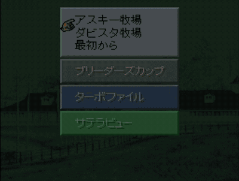 | **BS-X carts with a Memory Pack slot** Added support for the Satellaview 8M Memory Pack slot for the Japanese games that use it — drop the pack dump at /sd2snes/saves/&lt;BB&gt;/&lt;rom&gt;.mpk (&lt;BB&gt; = the first two characters of the ROM name, e.g. /sd2snes/saves/BS/) and the game reads the Memory Pack contents (saved sound novels, downloaded races…). On top of that, Derby Stallion 96 and Sound Novel Tsukuru now work. |
| 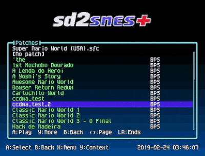 | **IPS/BPS patch at boot** The heart of rom-hacking: apply fan translations, hacks and fixes without altering the ROM. Drop the .ips/.bps patch in the ROM's folder, named after the game plus a suffix of your own (`Zelda - PT-BR.ips` for `Zelda.sfc`); at launch the firmware lists every patch it finds -- the list scrolls, with a page jump on the d-pad and L/R for the ends -- and applies the chosen one in memory, leaving the original ROM untouched. A patch named *exactly* like the ROM with no suffix is skipped on purpose -- that is the shape "Create patched ROM" leaves behind, and re-applying it would corrupt the copy. The list shows each patch by its suffix rather than repeating the game name, and for an .ips you can pin whether it was authored against a headered or headerless ROM when the automatic detection cannot tell -- the choice is remembered per patch. Y on a row opens a context menu with that setting and with "Create patched ROM", which writes a ready-patched copy next to the original. |
| 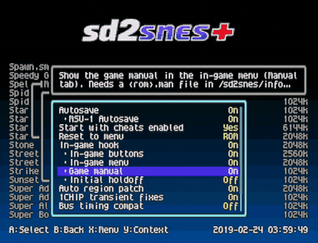 | **A description for every menu option** From firmware 2.11 on, every settings option shows a line explaining what it does, right on screen — in Portuguese, English, Spanish, German, French and Italian. It's easy to understand each setting without a manual. |
| 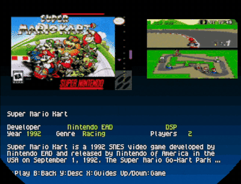 | **Warns when a chip's BIOS is missing** Some games use special chips (DSP in Super Mario Kart, Super FX in Star Fox, SA-1, S-DD1, OBC1, CX4, Super Game Boy, BS-X…) that need support files on the card. From firmware 2.11 on, if one is missing, instead of freezing or booting a broken game, the menu shows which file is missing and returns to the menu without resetting the console. |
| 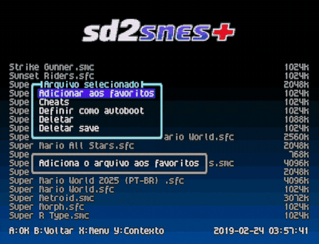 | **Delete a file and its savegame** From the browser's context menu (Y), delete the selected file or just the ROM's save (.srm) — right on the console, without pulling the card out or turning on a PC. |
| 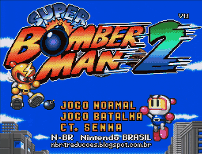 | **Reset brings you back where you were** A short reset can drop you back in the menu already inside the folder of your last game — or right on the ROM you were playing. Pick it in In-game Settings → Reset to menu: Off, On, Folder or ROM. |

Each feature has a full guide, screenshots and web tools on the site — start at **[Features & guides](https://sd2snes.ludufre.com/#recursos)**.
Tools: [Theme gallery](https://sd2snes.ludufre.com/gallery/) · [Theme Creator](https://sd2snes.ludufre.com/theme/) · [Sound Creator](https://sd2snes.ludufre.com/sounds/) · [Web Manager — covers, info & cheats](https://sd2snes.ludufre.com/manager/) · [GamesDB](https://sd2snes.ludufre.com/gamesdb/).

## Credits & license

- IPS/BPS patching and the original reset-to-menu work: [@Xeroxxx](https://github.com/mrehkopf/sd2snes/pull/293) (adapted here).
- In-game cheat menu: [@Relikk](https://github.com/Relikk).
- 6502 CPU core used by the Atari 2600 core: [verilog-6502](https://github.com/Arlet/verilog-6502) by [@Arlet](https://github.com/Arlet) (Arlet Ottens), vendored in `verilog/sd2snes_a26/arlet/`. The TIA, RIOT, video and audio blocks around it are original implementations written from public documentation.
- SPC7110 core: written for this fork. The ALU, data port, memory mapping and decompressor are RTL adaptations of the SPC7110 implementation in [ares](https://github.com/ares-emulator/ares) (ISC, © 2004-2025 ares team, Near et al; original decompressor by neviksti, optimized by talarubi) — every derived file carries the ISC notice. The RTC-4513 interface and the register protocol around it were written from public documentation.
- Sufami Turbo support: written for this fork. The cartridge memory map was taken from the board database of [ares](https://github.com/ares-emulator/ares) (ISC, © 2004-2025 ares team, Near et al) — board `BANDAI-PT-923` — cross-checked against [MAME](https://github.com/mamedev/mame) (`sns_rom_sufami`, BSD-3-Clause, © Fabio Priuli) and the fullsnes hardware notes. No code from either project is used: both are reference documentation for a map the hardware defines.
- Z80 CPU core used by the Master System core: [TV80](https://github.com/hutch31/tv80) by Guy Hutchison, based on the T80 core by Daniel Wallner, vendored in `verilog/sd2snes_sms/tv80/`.
- Project, translation, covers and web tools: [@ludufre](https://github.com/ludufre).
- Original [sd2snes project](https://github.com/mrehkopf/sd2snes) and its contributors: [@mrehkopf](https://github.com/mrehkopf), [@RedGuyyyy](https://github.com/RedGuyyyy), [@Relikk](https://github.com/Relikk), [@furious](https://github.com/furious), [@redacted173](https://github.com/redacted173), [@francois-berder](https://github.com/francois-berder), [@Godzil](https://github.com/Godzil), [@mlarouche](https://github.com/mlarouche), [@devinacker](https://github.com/devinacker), [@Xeroxxx](https://github.com/Xeroxxx), [@tcprescott](https://github.com/tcprescott), [@freelancer42](https://github.com/freelancer42), [@LuigiBlood](https://github.com/LuigiBlood), [@DevLaTron](https://github.com/DevLaTron), [@gasparitiago](https://github.com/gasparitiago).

Licensed under **GPL-2.0**, following the original sd2snes project. sd2snes+ changes © 2026 Luan Freitas and contributors. Source for every released binary is in this repository and its Git tags/releases. See also the [original README](https://github.com/mrehkopf/sd2snes/blob/master/README.md) and [Save States (FURiOUS)](https://github.com/mrehkopf/sd2snes/blob/master/README.Savestates.FURiOUS.md).
