

**🌐 Language:** English · [Português 🇧🇷](https://sd2snes.ludufre.com/?lang=pt) · [Español 🇪🇸](https://sd2snes.ludufre.com/?lang=es) · [Deutsch 🇩🇪](https://sd2snes.ludufre.com/?lang=de) · [Français 🇫🇷](https://sd2snes.ludufre.com/?lang=fr) · [Italiano 🇮🇹](https://sd2snes.ludufre.com/?lang=it) · [Русский 🇷🇺](https://sd2snes.ludufre.com/?lang=ru) · [Nederlands 🇳🇱](https://sd2snes.ludufre.com/beta.html?lang=nl)

> **What is this?** A version of the [original sd2snes firmware](https://github.com/mrehkopf/sd2snes) by [@mrehkopf](https://github.com/mrehkopf) that keeps the firmware base and adds user-facing extras. Use this repo only for issues about **those additions** — for core firmware issues, use the original project.

## 👉 Full guides, downloads, tools and FAQ: **[sd2snes.ludufre.com](https://sd2snes.ludufre.com)**

Everything below is a quick overview. **The site has the step-by-step guides, screenshots and the web tools** — head there for anything beyond the basics.

## Get it running

1. Download the **full** `.zip` from [**Releases**](https://github.com/ludufre/sd2snes/releases).
2. Copy its contents to the **root of your SD card** (replace when asked).
3. **Fill your library:** with the SD card still in your computer, open the **[Web Manager](https://sd2snes.ludufre.com/manager/)** in your browser and connect the card — it scans your ROMs and downloads **box art, game-info cards (with animated video clips) and cheats** straight onto the card. Runs in the browser, nothing to install.
4. Put the card back and power on. The first boot offers a **tour of what's new** (one card per feature, each with its option right there) and asks you to set the clock: set it then, or later from Settings → Time; if you would rather not be asked at all, switch **Ask for clock on boot** off in Browser Options. Change the language anytime in the **Language** menu.

> [!NOTE]
> No games/ROMs are included — use your own legally obtained files.

> [!IMPORTANT]
> **Updating from 2.15 or older?** 2.15 moved saves, cheats, savestates, covers and game info into **two-letter folders** (`/sd2snes/saves/SU/Super Mario World.srm`), which is what makes a game open instantly on a card holding thousands of files, and **2.16 gives every console a folder of its own inside those** (`sgb`, `nes`, `sms`, `a26`, `sft`) — a sidecar is named from the ROM's stem, so before this a `Tetris (USA).nes` and a `Tetris (USA).sfc` shared one cover, one game-info card and one set of cheats. Nothing is deleted, but until the card is reorganised those files look like they are gone. The **[Web Manager](https://sd2snes.ludufre.com/manager/)** reads the firmware version off the card and organises it accordingly.

Downloads, the step-by-step install and troubleshooting live on the site:
[Downloads](https://sd2snes.ludufre.com/#downloads) · [Install guide](https://sd2snes.ludufre.com/#comecar) · [FAQ](https://sd2snes.ludufre.com/#faq) — e.g. [Which firmware version do I have?](https://sd2snes.ludufre.com/#faq-versao) · [Black screen / blinking LED on Mk.II?](https://sd2snes.ludufre.com/#faq-tela-preta)

## What sd2snes+ Adds

| Preview | Feature |
| :-----: | :------ |
| 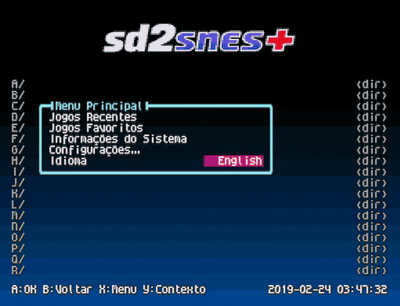 | **Menu in Portuguese, English, Spanish, German, French, Italian, Russian & Dutch** The whole firmware menu, messages and screens translated to Brazilian Portuguese, Spanish, German, French, Italian, Russian and Dutch. The original English stays available — just pick one. **Japanese and Simplified Chinese** too (in development, `feat-cjk`): the ideographs are not in the 256-tile font, they are drawn on the fly from a glyph cache in VRAM, so the whole menu, the game info card (including a game's own `title_ja`/`description_ja` text) and the tour read in Japanese or Chinese; their files go in `/sd2snes/lang/`, and the in-game menu stays in English for them. Since 2.16.1 the menu clock follows that choice too: `DD/MM/YYYY` in Portuguese, Spanish, French and Italian, `DD.MM.YYYY` in German and Russian, `DD-MM-YYYY` in Dutch (2.17), `MM/DD/YYYY` in English, with the time after the date. |
| 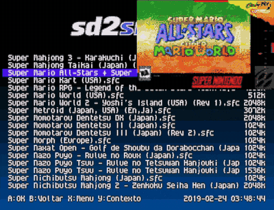 | **Box-art in the game list** As you browse, the game's official cover shows up on screen. Just drop a .cov file with the same name as the ROM in the same folder. To build the whole collection at once, the Web Manager downloads box art in bulk (and the cheats too).  Since 2.16.2 the menu no longer freezes while you browse on first-generation Super Famicom consoles (the SHVC-CPU-01 board, with S-CPU version 1): a screen update could end right before the background effect started — the one moment that CPU revision cannot take. |
| 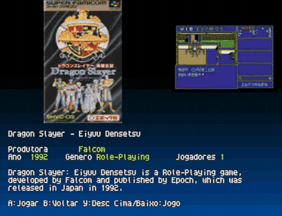 | **See the game's info card before playing** Before a ROM boots, a full-screen card shows the cover, a screenshot (or an animated clip with sound) and the game's metadata — publisher, developer, year, players, genre and special chip — plus a short description. In the menu you can choose whether the clip plays (with its soundtrack) or just a static snapshot shows. The Web Manager downloads each game's info card automatically.  Since 2.17 SELECT on the card opens that game's cheat list (the footer reads *Sel: Cheats*). Accented and Cyrillic letters in the title and description no longer turn into `?`, a translated description shows in full, typographic punctuation (dashes, curly quotes, ellipses) comes out in plain ASCII, and stepping from one game to the next fades faster. |
| 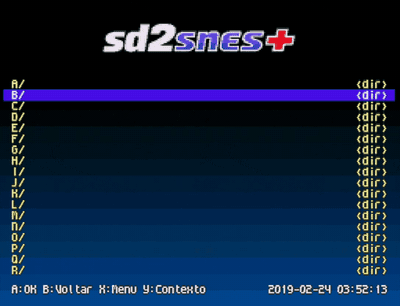 | **Menu music and sounds** Plays an .spc track in the background while you browse — plus 4 navigation sound effects (cursor, confirm, back, error). Build it all in the Sound Creator: pick the .spc, preview it in the browser, swap the effects and download them ready for the card. Turn **Random music** on and the menu draws a different track out of your music folder every time it loads — on boot and on every return from a game. Point it at any folder you like from the Web Manager. Random music is **on by default**, and the release ships three freely licensed tracks in `/sd2snes/music/` (listed under [Menu music](#menu-music)); add your own `.spc` files to that folder or delete the ones you do not like. `menu.spc` is the fallback when the folder is empty.  `.pcm` files — the MSU-1 soundtracks — now show up in the browser too: press A on one and a small player opens, with a progress bar, the elapsed and total time, and A to pause. The track plays on the cartridge's own audio channel, so the menu stays usable underneath and B closes the player and puts the menu music back.  An MSU-1 game folder stays tidy: the tracks are listed after the ROM, in track order (2 before 10), and the folder itself shows the game's cover while highlighted. When the folder holds a single ROM, pressing A on the folder opens that game straight away — the info card or the boot, as you set it (**Browser options → Open MSU-1 folders as games**). Since 2.17 Y on such a folder opens its ROM's context menu — cheats, delete and the rest — just as on the ROM itself. |
| 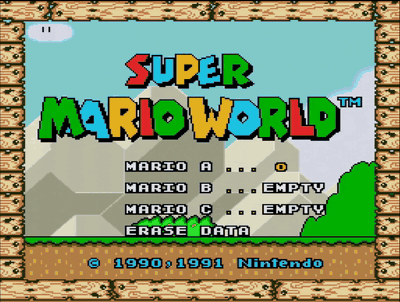 | **In-game menu with tabs** Pause the running game with L + R + Y + ← and get a full menu drawn in your theme, with five tabs: **CHEATS** (toggle codes live, or add and edit them with an on-screen keyboard), **SAVESTATES** (pick the slot, occupied ones are marked), **SAVES** (battery save status and the SRAM slot selector), **GUIDES** (the game's manuals on screen) and **TRAINER** (search the game's memory for a value and freeze it). Since 2.17 the ON/OFF beside each cheat in the CHEATS tab is translated too, in every menu language. Press **SELECT** on the tab bar for a cheat sheet of every in-game shortcut — open this menu, save and load state, pick a slot, reset the game, back to the menu, cheats on and off, in-game buttons off — each one spelled with the buttons that are really armed for the game you are playing, including your own `IngameButtonsMenu` combo and the per-game savestate combos. B steps back, START closes, and the game resumes exactly where it left off — it even remembers the tab, the cursor and the page you were reading. Since 2.17 the shortcuts can also come from **controller 2** (*In-game Settings → Buttons on controller 2*, off by default): controller 1 keeps priority, so a second player's buttons never combine with yours into a shortcut nobody pressed. Since 2.16 the combo is no longer fixed: if it clashes with a game, set your own on the `IngameButtonsMenu` line of the card's `config.yml` — any combination of three buttons or more. Available on special-chip games too — every chip except the Super Game Boy (on SPC7110 the menu works but savestates stay off). |
| 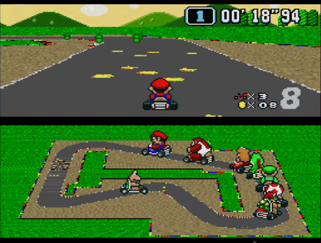 | **Savestates on special-chip games** Savestates never worked on games with a special chip — now they do: **DSP1/1b/2/3/4** (Super Mario Kart, Pilotwings), **Super FX** (Star Fox, Yoshi's Island), **OBC1** (Metal Combat), **S-DD1** (Star Ocean) and **CX4** (Mega Man X2/X3) on both Mk.II and Mk.III, plus **SA-1** (Super Mario RPG) on the FXPak Pro (Mk.III) only. Save with Start + R, load with Start + L, pick the slot with Select + D-pad or in the SAVESTATES tab. A handful of games need a different combo because Start pauses them (the SAVESTATES tab and the in-game shortcut list always show the combo that applies to the running game) — those are listed in `/sd2snes/savestate_inputs.yml` on the card (Donkey Kong Country 1/2/3, Yoshi's Island, Mega Man X/X2/X3 and Star Fox use X + R / X + L; Super Valis IV uses A + R / A + L). It is a plain checksum-to-combo list, so you can add your own games to it. Built on top of the [save states by FURiOUS](https://github.com/mrehkopf/sd2snes/blob/master/README.Savestates.FURiOUS.md).  Since 2.17 savestates and the **In-game hook** they need are **on out of the box** (they used to ship off, so a fresh card had no savestates and no in-game menu until both were switched on). A game that misbehaves with the hook can still have it turned off in *Configuration → In-game Settings*. |
| 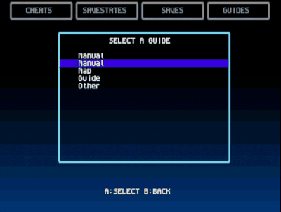 | **Read the game manual on your TV** Convert a PDF manual, walkthrough, map or insert to `.man` (see `utils/gen_man.py`), drop it in `/sd2snes/info/<BB>/` next to the game's other info files, and read it on the TV with the game frozen — from the GUIDES tab, or straight from the game info card by pressing X before you start. L/R turns the page, A zooms 2x and the D-pad pans across the enlarged page; it remembers where you stopped. Up to 8 documents per game, each with its own title and type. The Web Manager downloads them for you. |
| 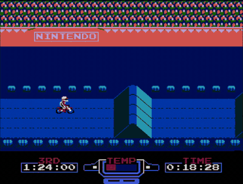 | **Master System, NES and Atari 2600 (experimental, Mk.III only)** The FPGA learned to become three more consoles: drop a `.sms`, `.nes` or `.a26` on the card and it shows up in the list like any other game. All three have sound — the NES and the Master System got their audio in 2.16 (the Master System's PSG plays through the cartridge's own audio channel) — and all three take an in-game pad combo to reset the game without touching the console, plus a service combo that repaints the palette if it ever comes out wrong. **This is a preview, not a finished feature:** NES games with a battery run but **do not save**, and the Master System does not write to cartridge RAM; compatibility is low and many games freeze or glitch. NES mappers 0, 1, 2, 3, 4 (MMC3 and, with an NES 2.0 header, MMC6), 7, 11, 18, 19 (Namco 163), 21, 22, 23, 25 (Konami VRC2/VRC4), 24, 26 (VRC6), 28, 32, 33, 34, 48, 65, 66, 69 (FME-7), 70, 71, 72, 75 (VRC1), 78, 79, 80, 82, 86, 87, 88, 89, 93, 94, 95, 97, 113, 140, 152, 154, 180, 184, 185, 206 (Namco 108), 210 and 232 are supported. Cartridges with their own sound chip (the VRC6, Namco 163 and Jaleco boards) play with the expansion channels missing.  The **Atari 2600** is the newest and the roughest of the three. It plays NTSC cartridges of 2K and 4K plus the F8, F6 and F4 bankswitching schemes, including their Superchip variants (F8SC/F6SC/F4SC, with the extra 128 bytes of RAM); E0, 3F, FE, FA, DPC and Supercharger carts, PAL games and the paddle/keypad/driving controllers are **not** supported yet. Both joysticks are mapped to the SNES pads — D-pad to move, B/A/Y to fire — and the console switches to the rest: hold **Start** for the console's RESET switch, hold **Select** for SELECT, **X** flips Color/B&W and **L**/**R** flip the left/right difficulty switches. Holding L + R together leaves the switches inert, so the in-game reset combos keep working. Sound is the TIA's two channels with all 16 waveform modes. The picture is drawn in two bits per pixel with the colours changed line by line, and a menu option picks its width: **160 (1:1)**, the console's own resolution with black bars at the sides, or **256**, filling the screen.  See the [compatibility list](https://sd2snes.ludufre.com/gamesdb/compatibility). |
| 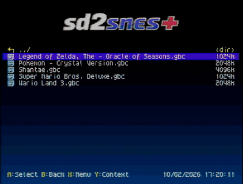 | **Game Boy Color (experimental, Mk.III only)** Drop a `.gbc` on the card and it runs on a Game Boy Color core instead of the Super Game Boy one — in colour, at full speed, including the double-speed mode. `.gb` files whose header asks for a Color console go there too; the rest keep using the Super Game Boy core. **Game Boy Color mode** in *Configuration → SGB Settings* overrides the choice: *Auto*, *Prefer SGB* (only the Color-only games leave the Super Game Boy, so everything else keeps its border and SGB colours) or *Prefer GBC* (every Game Boy game goes to the Color core). Next to it, **Game Boy Color sync** picks *Genlock* (the default: the Game Boy frame is locked to the SNES one, about 0.6 % faster than a real Game Boy, so no frame is ever skipped) or *Exact* (the real Game Boy clock, at the cost of an occasional skipped frame), and **Game Boy Color stretch** (off by default) makes the hi-colour screens the core draws as a full picture fill 256×192 instead of sitting at 160×144 in the middle: a still picture comes out clean, an animated one shows 8-line bands, and the ordinary game screens keep their size. All three are also in `config.yml` as `GbcMode` (0/1/2), `GbcSync` and `GbcStretch` (`false`/`true`), and all three are greyed out on the Mk.II, where they have no effect. The FPGA runs the console and the SNES redraws the picture from the Game Boy's own tiles, maps, sprites and palettes, following the scroll, the window, the background map, the tile set and the palettes line by line. Battery saves and the cartridge clock work (`.srm` and `.gtc`, next to the Super Game Boy saves). It ships with the open-source boot ROM from [SameBoy](https://github.com/LIJI32/SameBoy), so no BIOS file is needed.  **This is a preview, not a finished feature:** screens that repaint the palettes on every scanline — the "hi-colour" title screens and cutscenes of a good part of the library — are now drawn as a full picture in the right colours (with *Genlock* sync, the default), but animated ones can lose smoothness or show bands while they refresh; with **Game Boy Color stretch** on, these screens fill 256×192. There are no savestates, cheats or in-game menu on this core yet, 8 MB cartridges do not run, sound has not been checked against a reference, and it has not been tried on first-generation consoles with the version-1 S-CPU (SHVC-CPU-01 board): that CPU revision can hang when a graphics transfer overlaps the line-by-line effects, and this core does that every frame. On the **Mk.II** the core does not fit the FPGA: `.gb` and `.gbc` keep booting on the Super Game Boy core there, so only games that also run on the original Game Boy work, without colour.  See the [compatibility list](https://sd2snes.ludufre.com/gamesdb/compatibility). |
| 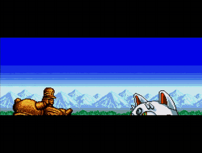 | **Far East of Eden Zero and the other SPC7110 games** The SPC7110 is the Hudson coprocessor found in a handful of Japanese carts — *Far East of Eden Zero* (Tengai Makyou Zero), *Momotarou Dentetsu Happy* and *Super Power League 4*. It decompresses graphics in hardware, multiplies and divides for the game, walks a second data ROM through a pointer engine and, on *Far East of Eden Zero*, carries a battery-backed real-time clock. The English fan translation of *Far East of Eden Zero* also works: its 7 MB image adds a third chip — an expansion ROM the board maps at banks $40-4f — which the core maps as well (thanks to [@terminator2k2](https://github.com/terminator2k2) for the original fix). The in-game menu and the cheat overlay work here like on the other chips; savestates are the one thing still off on this chip — the decompressor's internal state cannot be captured yet. The core is written for this fork, with the chip's behaviour taken from the [ares](https://github.com/ares-emulator/ares) C++ implementation. |
| 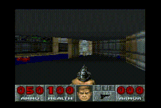 | **Super FX 3: DOOM (2025) and the Star Fox FX3 patches** **Up front: this does not run at the real cartridge's speed — the sd2snes FPGA cannot match the 2025 chip.** *Star Fox* plays at full speed, but *DOOM* sits at ~11 fps against the cartridge's 20 fps cap, which lands on the feel of the 1995 SNES *DOOM*. The in-game menu, cheats and savestates stay off on FX3 carts. The implementation is original to this fork, written from the publicly released Super FX 3 specification by Randal Linden plus black-box behavioural testing and measurements on real hardware — no code from any other implementation was used. |
| 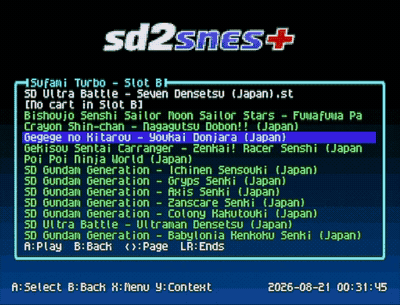 | **Sufami Turbo minicarts (Mk.II and Mk.III)** The Sufami Turbo is the Bandai passthrough cartridge with **two** minicart slots. Drop the `.st` dumps on the card, add the base cartridge BIOS as `/sd2snes/stbios.bin`, and sd2snes+ boots them — picking the **Slot B** companion cart in a dialog right before the game starts, and remembering the pair for next time. Both minicarts keep their own battery save. On the Mk.II they run on the `fpga_basex.bit` core, which ships in the package; without it the menu names the missing file. |
| 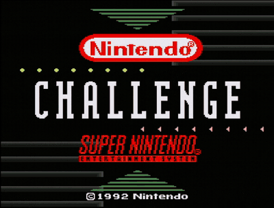 | **Nintendo's tournament carts: Campus Challenge '92 and PowerFest '94** The cartridges Nintendo built for its official competitions — three timed games and a score screen, driven by a hardware round timer — boot as plain `.sfc` dumps: **Campus Challenge '92** (Super Mario World, F-Zero, Pilotwings) and **PowerFest '94** (Super Mario Bros.: The Lost Levels, Super Mario Kart, Ken Griffey Jr.). All five circulating dumps are recognized — originals, repros and the score hacks. The round length is the DIP switch bank of the real boards: set it under Chip options → **Competition Cart timer (min)**, 3–18 minutes (6 was the event setting). Needs `dsp1b.bin` on the card (both carts carry a DSP-1). Thanks to [@terminator2k2](https://github.com/terminator2k2), who brought these carts to sd2snes first. |
| 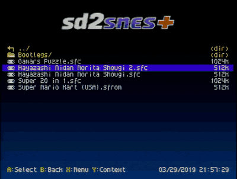 | **Seta ST011: *Hayazashi Nidan Morita Shougi* (Mk.II and Mk.III)** The ST011 is the Seta coprocessor inside *Hayazashi Nidan Morita Shougi*, a cartridge that used to stop at an error screen. It now has a core of its own: the game boots and the computer plays against you. Copy the chip firmware to the card as `/sd2snes/st011.rom` — the menu names the missing file if you forget. Savestates and the in-game menu stay off on this core. Core by M2M ([@sttng](https://github.com/sttng)). New in 2.17. |
| 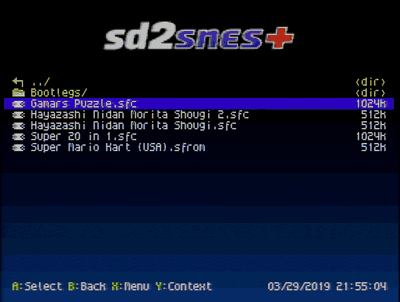 | **Seta ST018: a 32-bit ARM in the cartridge (Mk.II and Mk.III)** *Hayazashi Nidan Morita Shougi 2* carries a 32-bit ARM coprocessor, the ST018. The core includes that CPU, written from scratch. Copy the chip firmware to the card as `/sd2snes/st018.rom` — the menu names the missing file if you forget. Savestates and the in-game menu stay off on this core. Core by M2M ([@sttng](https://github.com/sttng)). New in 2.17. |
| 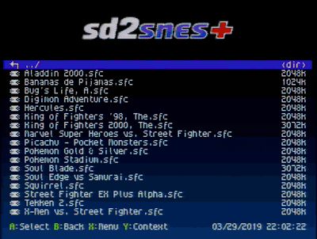 | **Copy-protected bootlegs, from the untouched dump (Mk.II and Mk.III)** Unlicensed carts with a copy-protection chip run from the original file, no cracked version needed: *Aladdin 2000*, *Digimon Adventure*, *King of Fighters '98* and *2000*, the *Pokemon* bootlegs, *Soul Blade*, *Tekken 2*, *Street Fighter EX Plus Alpha*, *X-Men vs. Street Fighter*, *Marvel Super Heroes vs Street Fighter*, *A Bug's Life*, *Hercules* and more — recognized by checksum, the full list is in [`verilog/sd2snes_bootleg/README_BOOTLEG.md`](verilog/sd2snes_bootleg/README_BOOTLEG.md). Savestates and the in-game menu stay off on this core. Core and dump tools by M2M ([@sttng](https://github.com/sttng)). New in 2.17. |
| 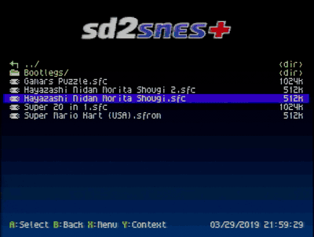 | **Super 20 in 1 (Mk.II and Mk.III)** The Korean **Super 20 in 1** multicart opens its own menu and switches games like the real cartridge. They are NES games ported to the SNES, such as *Spartan X* and *TwinBee*. It loads as a plain dump; savestates and the in-game menu stay off on this core. Core by [@terminator2k2](https://github.com/terminator2k2); Mk.II build by M2M ([@sttng](https://github.com/sttng)). New in 2.17. |
| 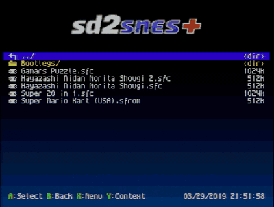 | **Gamars Puzzle (Mk.II and Mk.III)** The unlicensed Taiwanese puzzle game **Gamars Puzzle** has a memory map of its own and now boots as a plain dump. On the Mk.II it runs on the `fpga_basex.bit` core, which ships in the package; without it the menu names the missing file. Support by [@terminator2k2](https://github.com/terminator2k2). New in 2.17. |
| 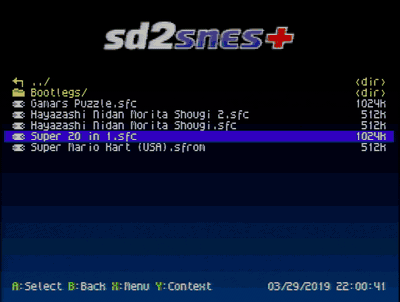 | **`.sfrom` files (SNES Classic)** `.sfrom`, the ROM container used by the SNES Classic, shows up in the browser and boots like any ROM: saves, cheats and patches work the same. The [Web Manager](https://sd2snes.ludufre.com/manager/) and the GamesDB identify the game by the ROM stored inside the file, so the cover and the info card are the same as for the `.sfc`. Firmware support by [@terminator2k2](https://github.com/terminator2k2). New in 2.17. |
|  | **Find your own cheats: the RAM trainer** Nobody published a code for the thing you want to change? Find it yourself. The **TRAINER** tab searches the console's memory while the game sits frozen. Type the number you can see on screen — lives, coins, HP — and it lists every address holding it. Play a bit, reopen the menu, filter again, and the list shrinks until only the right address is left. When the number is not on screen, start an **Unknown** search instead and filter by *changed*, *unchanged*, *increased*, *decreased*, *greater* or *less* — the same way you would hunt an invisible value. Works on 8-bit and 16-bit values.  Pick an address to see what it holds right now, write a new value once, or **freeze** it so the game cannot change it back (up to four at a time). Addresses you set or froze stay in the results — marked FROZEN while they are held — even when a later filter would drop them, and even across a new search, until you pick **Remove from list**. Freezing does not touch your cheat list: it rides the same engine as the cheats, so it obeys the master switch, and it is gone when you load another game. When you want to keep a find, **Save cheat** turns it into a real cheat at the top of the CHEATS tab and writes it to the game's YAML. Loading a savestate keeps the search going, and the relative filters then compare against the values you just loaded, so the usual "load, lose a life, filter, load again" hunt works. Available wherever the in-game menu is — Mk.II and Mk.III alike. Searches cover the SNES work RAM ($7E0000-$7FFFFF); the extra RAM inside special chips is not scanned. |
| 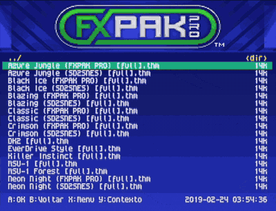 | **Switch the menu theme on the console** From firmware 2.9 on, pick the menu theme right on the SNES — logo, colours, background and selection bar. Drop .thm files in any folder on the card and choose one in the browser. Grab ready-made themes in the [gallery](https://sd2snes.ludufre.com/gallery) or build your own in the [web editor](https://sd2snes.ludufre.com/theme). Since 2.15 the **sd2snes+** theme is the factory default, with *Restore classic theme* in Browser Options to bring the old look back; themes can also switch off the text outline and the anti-aliasing, and toggle the selection-bar shadow. Since 2.16 those two are yours to set as well, independently of the theme: **Text outline** and **Anti-aliasing** in Browser Options change the menu font on the spot, without reloading the menu. Since 2.16.2 the card's own `/sd2snes` folder can be listed as well (**Browser Options → Show sd2snes folder**, off by default), which is how you reach `classic.thm`, the menu music or a sound effect without the Web Manager. |
| 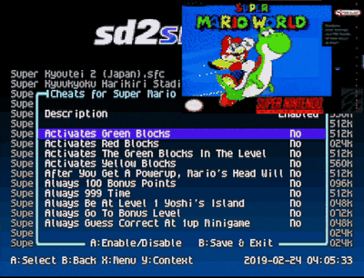 | **Cheat manager in the menu** The sd2snes already applies cheats per game — what sd2snes+ adds is the in-menu manager: from the context menu (Y) you turn each code on or off on the console, without editing the YAML on a PC. The files live under /sd2snes/cheats, grouped into two-letter folders (Super Mario World.yml → /sd2snes/cheats/SU/); grab ready-made cheats at gamehacking.org, exporting as FXPak Pro 1.7 (.yml), or let the Web Manager download and file them for you.  Since 2.16.4 you can also **type cheats in on the console**: Select adds a new one and Y edits the one under the cursor — both in this list and in the in-game menu's CHEATS tab. An on-screen keyboard shows only the characters a code can use (Game Genie `XXXX-YYYY` or Pro Action Replay `AAAAAADD`, the two formats the firmware already accepts — a legend under the keys reminds you of both), a second keyboard types the optional name, and a cheat can hold several codes. The editor also deletes the cheat, after a confirmation. Every add, edit or delete is written to the YAML at once — a new cheat goes to the top of the file and starts enabled — so a code you found with the trainer, or read off a website, is saved without ever pulling the card. |
| 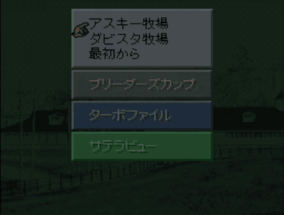 | **BS-X carts with a Memory Pack slot** Added support for the Satellaview 8M Memory Pack slot for the Japanese games that use it — drop the pack dump at `/sd2snes/saves/<BB>/<rom>.mpk` (&lt;BB&gt; = the first two characters of the ROM name, e.g. /sd2snes/saves/BS/) and the game reads the Memory Pack contents (saved sound novels, downloaded races…). On top of that, Derby Stallion 96 and Sound Novel Tsukuru now work. On the Mk.II the games that use the slot (any LoROM, or a HiROM up to 2 MB, with its `.mpk` in place), plus Derby Stallion 96 and Sound Novel Tsukuru, run on the `fpga_basex.bit` core, which ships in the package; without it the menu names the missing file. |
| 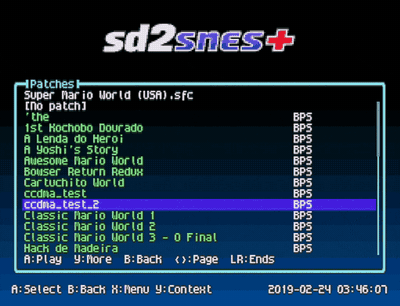 | **IPS/BPS patch at boot** The heart of ROM hacking: apply fan translations, hacks, and fixes without altering the original ROM. Drop the .ips/.bps patch into the ROM’s folder, named after the game plus a suffix of your choice (`Zelda - PT-BR.ips` for `Zelda.sfc`). At launch, the firmware lists every patch it finds. The list scrolls, with D-pad page jumps and L/R to jump to the beginning or end, and the selected patch is applied in memory, leaving the original ROM untouched. In the patch list, each patch can be configured for a headered or headerless ROM, or left on Auto to let the system detect the ROM format automatically. The choice is remembered per patch. Press Y on a patch to open a context menu containing this setting and Create Patched ROM, which writes a ready-patched copy next to the original (It may take a few minutes if guides and manuals are included). |
| 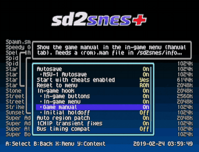 | **A description for every menu option** From firmware 2.11 on, every settings option shows a line explaining what it does, right on screen — in Portuguese, English, Spanish, German, French, Italian, Russian and Dutch. It's easy to understand each setting without a manual. |
| 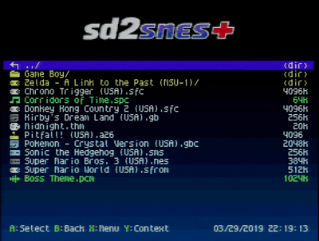 | **File-type icons in the browser** Every row of the file browser starts with a small icon for what it is: folder, SNES, NES, Master System, Game Boy, Game Boy Color or Atari 2600 game, `.spc` music, `.pcm` track, theme or plain file. A folder that opens as its MSU-1 game (**Open MSU-1 folders as games**) shows the SNES controller instead of the folder icon, so you can tell at a glance which folders are games. And in every key hint (the footer lines such as "A: Play   B: Back") the button names are drawn in green, in the menu and in the in-game menu alike. New in 2.17. |
| 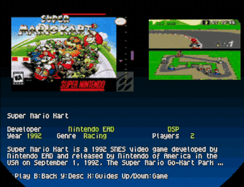 | **Warns when a chip's BIOS is missing** Some games use special chips (DSP in Super Mario Kart, Super FX in Star Fox, SA-1, S-DD1, OBC1, CX4, Super Game Boy, BS-X…) that need support files on the card. From firmware 2.11 on, if one is missing, instead of freezing or booting a broken game, the menu shows which file is missing and returns to the menu without resetting the console. |
| 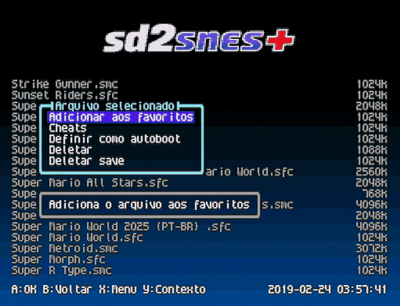 | **Delete a file and its savegame** From the browser's context menu (Y), delete the selected file or just the ROM's save (.srm) — right on the console, without pulling the card out or turning on a PC.  Since 2.16.2 deleting a ROM also clears what belonged to it: the box art beside it, the info card, screenshot, clip and guides under `/sd2snes/info`, its cheat file and its patch settings. Your saves are never part of that: battery saves, memory packs and savestates stay put, and *Delete save* remains its own action. Deleting a theme, an .spc or a .pcm never touches a game's files, even when the names match. With **Show sd2snes folder** on (Browser Options), the card's own files are listed as well — saves, savestates, cheat files, box art and info cards — and Y deletes them one at a time; the firmware, the menu and the FPGA cores show up too, but with no Delete entry. |
| 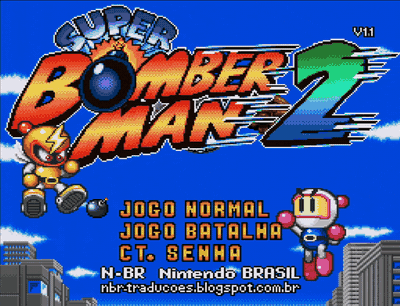 | **Reset brings you back where you were** A short reset can drop you back in the menu already inside the folder of your last game — or right on the ROM you were playing. Pick it in In-game Settings → Reset to menu: Off, On, Folder or ROM — or **Duration**, added in 2.16, which is the one that keeps the console's own reset button working the way you expect: a **short** press restarts the game you are playing, a **long** one (hold it, or press twice quickly) brings you back to the menu, in the game's folder with the ROM already selected. Since 2.17 **ROM** is the default, so out of the box the reset button no longer restarts the game: every press takes you back to the menu, in the last game's folder with that game selected. If you want a short press to restart the game, pick **Duration**. |
| 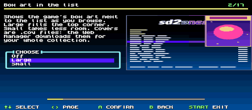 | **A tour of what's new, on the first boot** The first boot after installing or updating asks whether you want a tour, which opens with a short welcome clip (an animation with a jingle) and then shows one card per feature, with a picture of what it changes on screen and, where the feature is an option, its setting right there: A picks an answer, and everything is saved when the tour ends. Each release adds its own cards at the end, so after an update the tour comes back once showing only what is new. See it again any time under *Configuration → Tour of the new features*. In all eight menu languages. New in 2.17. |
| 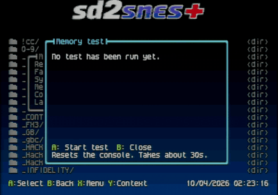 | **Memory test, on the console** Is the cartridge broken, or is it the firmware? Main menu → **Memory test** answers that without a serial cable and without flashing the separate diagnostic image. **A** runs the test (~30 s): first it walks the data and address lines of the PSRAM and of the 4 Mbit SRAM looking for open, stuck or shorted lines, and names the chip by its silkscreen — *U501: check data line D3*; then, if the wiring is sound, it writes and verifies every cell and reports the first bad address if it finds one. The screen goes dark and the console resets while it runs — that is expected, the FPGA is loaded with the test core meanwhile — and the menu comes back with the result. Needs `fpga_test.bit`/`.bi3` on the card (it ships with the release); without it the test simply declines, without touching the running console. |

Each feature has a full guide, screenshots and web tools on the site — start at **[Features & guides](https://sd2snes.ludufre.com/#recursos)**.
Tools: [Theme gallery](https://sd2snes.ludufre.com/gallery/) · [Theme Creator](https://sd2snes.ludufre.com/theme/) · [Sound Creator](https://sd2snes.ludufre.com/sounds/) · [Font Editor](https://sd2snes.ludufre.com/font/) · [Web Manager — covers, info & cheats](https://sd2snes.ludufre.com/manager/) · [GamesDB](https://sd2snes.ludufre.com/gamesdb/).

## Menu music

With **Random music** on (the default), every `.spc` in `/sd2snes/music/` is a candidate and the menu draws one each time it loads. Any file name works — the draw looks only at the `.spc` extension. The release ships these three; the same table is on the card as `/sd2snes/music/CREDITS.txt`. `/sd2snes/menu.spc` — the fallback when the folder is empty or Random music is off — is a copy of "28".

| File | Title | Author | Licence | Source |
|---|---|---|---|---|
| `un-tarde.spc` | un tarde | K. Jose | [CC BY 4.0](https://creativecommons.org/licenses/by/4.0/) | [The Mod Archive #212763](https://modarchive.org/index.php?request=view_by_moduleid&query=212763) |
| `jungle-song.spc` | Jungle song | Beyond | Public domain | [The Mod Archive #181158](https://modarchive.org/index.php?request=view_by_moduleid&query=181158) |
| `28.spc` | 28 | Beyond | Public domain | [The Mod Archive #181427](https://modarchive.org/index.php?request=view_by_moduleid&query=181427) |

The tracks were converted from the authors' Impulse Tracker modules to SPC700 with [SNESMOD](https://github.com/mukunda-/snesmod). Changes: "un tarde" had one sparse channel folded into another to fit the eight voices of the S-DSP; "Jungle song" and "28" had their samples resampled to fit the 64 KB of audio RAM; all three got S-DSP echo.

## Credits & license

- Menu music: "un tarde" by K. Jose, licensed under [CC BY 4.0](https://creativecommons.org/licenses/by/4.0/); "Jungle song" and "28" by Beyond (public domain). Each `.spc` embeds the [SNESMOD](https://github.com/mukunda-/snesmod) SPC700 driver (MIT, © 2009-2025 Mukunda Johnson).

- IPS/BPS patching and the original reset-to-menu work: [@Xeroxxx](https://github.com/mrehkopf/sd2snes/pull/293) (adapted here).
- In-game cheat menu: [@Relikk](https://github.com/Relikk).
- 6502 CPU core used by the Atari 2600 core: [verilog-6502](https://github.com/Arlet/verilog-6502) by [@Arlet](https://github.com/Arlet) (Arlet Ottens), vendored in `verilog/sd2snes_a26/arlet/`. The TIA, RIOT, video and audio blocks around it are original implementations written from public documentation.
- SPC7110 core: written for this fork. The ALU, data port, memory mapping and decompressor are RTL adaptations of the SPC7110 implementation in [ares](https://github.com/ares-emulator/ares) (ISC, © 2004-2025 ares team, Near et al; original decompressor by neviksti, optimized by talarubi) — every derived file carries the ISC notice. The RTC-4513 interface and the register protocol around it were written from public documentation. The expansion-ROM mapping used by the *Far East of Eden Zero* fan translations (banks $40-4f) was first implemented by [@terminator2k2](https://github.com/terminator2k2) in his fork.
- Competition cart support (Campus Challenge '92 / PowerFest '94): first implemented for sd2snes by [@terminator2k2](https://github.com/terminator2k2). This fork's implementation was written independently, from a register/timer specification recovered by disassembling the cartridges' own menu programs, cross-checked against [MAME](https://github.com/mamedev/mame) (`sns_pfest94`, BSD-3-Clause, © Fabio Priuli) for the PowerFest '94 timer rule.
- Seta ST011 and ST018 cores (including the ARMv3 CPU of the ST018, written from scratch), the copy-protected bootleg core with its dump tools, and the Mk.II build of the Super 20 in 1 core: M2M ([@sttng](https://github.com/sttng)). The bootleg protection schemes follow [fullsnes](https://problemkaputt.de/fullsnes.htm) and the nesdev research by nocash and Revenant, cross-checked against [MAME](https://github.com/mamedev/mame).
- Super 20 in 1 multicart core, Gamars Puzzle mapper and SFROM support: [@terminator2k2](https://github.com/terminator2k2), who also brought these contributions together. The Super 20 in 1 bank register follows [MAME](https://github.com/mamedev/mame)'s `sns_rom_20col_device` (GPL-2.0+, © Fabio Priuli, byuu).
- Sufami Turbo support: written for this fork. The cartridge memory map was taken from the board database of [ares](https://github.com/ares-emulator/ares) (ISC, © 2004-2025 ares team, Near et al) — board BANDAI-PT-923 — cross-checked against [MAME](https://github.com/mamedev/mame) (`sns_rom_sufami`, BSD-3-Clause, © Fabio Priuli) and the fullsnes hardware notes. No code from either project is used: both are reference documentation for a map the hardware defines.
- Z80 CPU core used by the Master System core: [TV80](https://github.com/hutch31/tv80) by Guy Hutchison, based on the T80 core by Daniel Wallner, vendored in `verilog/sd2snes_sms/tv80/`.
- Game Boy Color core: built on the Super Game Boy core of the original sd2snes project ([@RedGuyyyy](https://github.com/RedGuyyyy)), extended to the Color hardware from the [Pan Docs](https://gbdev.io/pandocs/), with [SameBoy](https://github.com/LIJI32/SameBoy) (MIT, © Lior Halphon), gambatte and [ares](https://github.com/ares-emulator/ares) as behavioural references; the OAM DMA bus-conflict rules follow SameBoy's model. The boot ROM shipped as `cgb_boot.bin` is SameBoy's, under the same MIT licence (`cgb_boot.LICENSE` on the card).
- Project, translation, covers and web tools: [@ludufre](https://github.com/ludufre).
- Original [sd2snes project](https://github.com/mrehkopf/sd2snes) and its contributors: [@mrehkopf](https://github.com/mrehkopf), [@RedGuyyyy](https://github.com/RedGuyyyy), [@Relikk](https://github.com/Relikk), [@furious](https://github.com/furious), [@redacted173](https://github.com/redacted173), [@francois-berder](https://github.com/francois-berder), [@Godzil](https://github.com/Godzil), [@mlarouche](https://github.com/mlarouche), [@devinacker](https://github.com/devinacker), [@Xeroxxx](https://github.com/Xeroxxx), [@tcprescott](https://github.com/tcprescott), [@freelancer42](https://github.com/freelancer42), [@LuigiBlood](https://github.com/LuigiBlood), [@DevLaTron](https://github.com/DevLaTron), [@gasparitiago](https://github.com/gasparitiago).

Licensed under **GPL-2.0**, following the original sd2snes project. sd2snes+ changes © 2026 Luan Freitas and contributors. Source for every released binary is in this repository and its Git tags/releases. See also the [original README](https://github.com/mrehkopf/sd2snes/blob/master/README.md) and [Save States (FURiOUS)](https://github.com/mrehkopf/sd2snes/blob/master/README.Savestates.FURiOUS.md).
